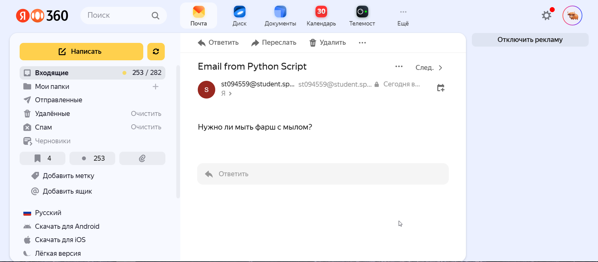
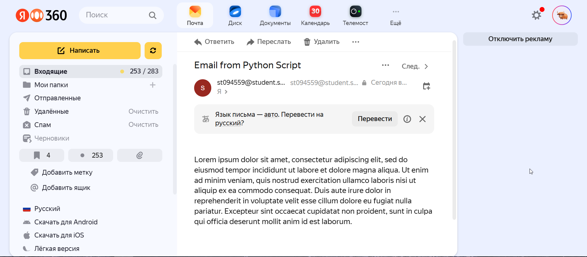
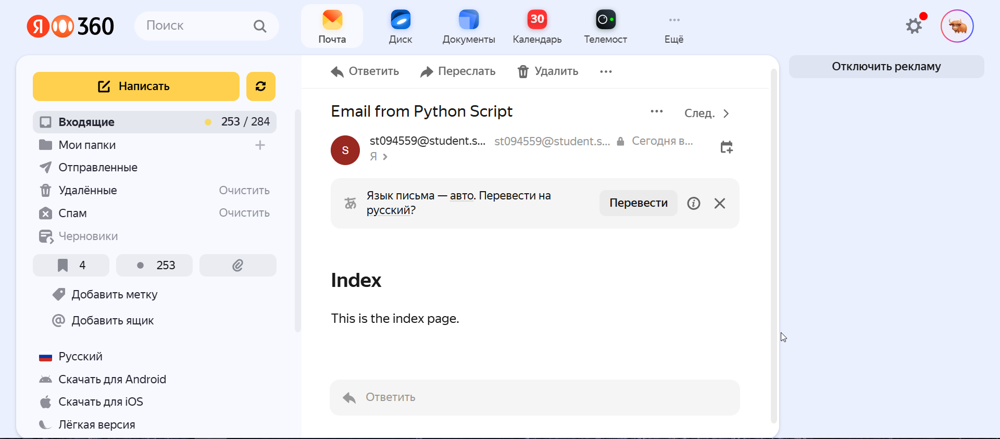
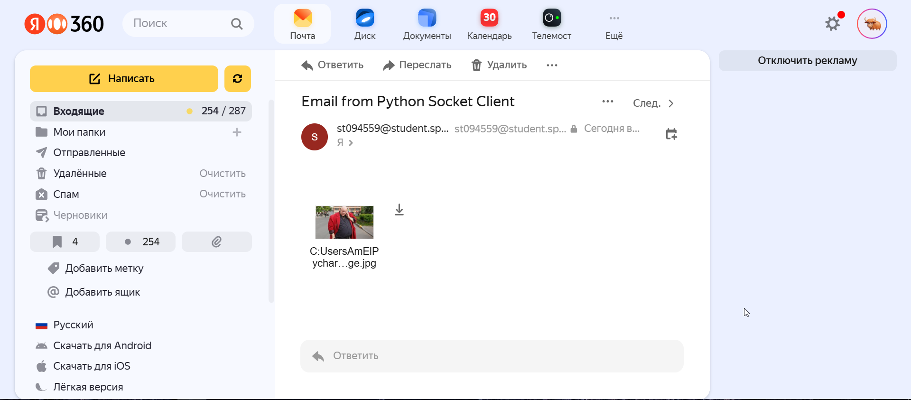
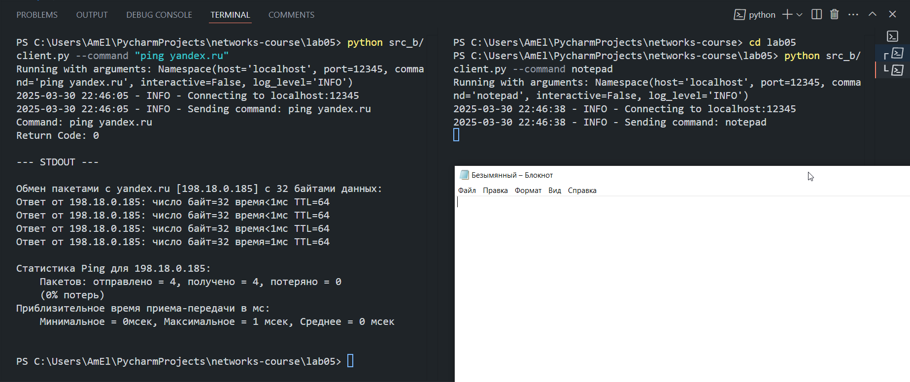
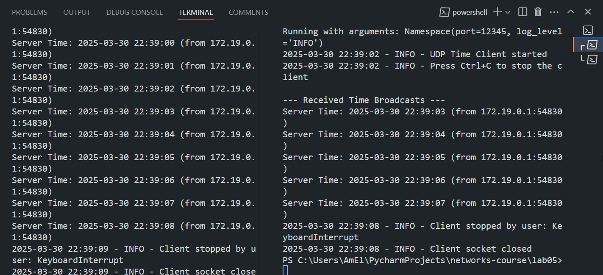

# Практика 5. Прикладной уровень

## Программирование сокетов.

### A. Почта и SMTP (7 баллов)

### Пролог
Если захотите проверить работу - отключите VPN, либо поменяйте smtp сервер на нужный.

### 1. Почтовый клиент (2 балла)
Напишите программу для отправки электронной почты получателю, адрес
которого задается параметром. Адрес отправителя может быть постоянным. Программа
должна поддерживать два формата сообщений: **txt** и **html**. Используйте готовые
библиотеки для работы с почтой, т.е. в этом задании **не** предполагается общение с smtp
сервером через сокеты напрямую.

```
usage: 1.py [-h] [--sender_email SENDER_EMAIL] --sender_password SENDER_PASSWORD
            [--receiver_email RECEIVER_EMAIL] [--mode {TEXT,FILE}] [--subject SUBJECT]
            [--smtp_server SMTP_SERVER] [--smtp_port SMTP_PORT]

simple python mail client for lab05A

options:
  -h, --help            show this help message and exit
  --sender_email SENDER_EMAIL
                        sender email address
  --sender_password SENDER_PASSWORD
                        sender password
  --receiver_email RECEIVER_EMAIL
                        receiver email address
  --mode {TEXT,FILE}    set the mail mode. For FILE mode .txt and .html only supported.
  --subject SUBJECT     email subject
  --smtp_server SMTP_SERVER
                        SMTP server address
  --smtp_port SMTP_PORT
                        SMTP server port
```

#### Демонстрация работы

Отправка обычного текстового сообщения:


Отправка из файлов с `.txt` и `.html` расширениями:





### 2. SMTP-клиент (3 балла)
Разработайте простой почтовый клиент, который отправляет текстовые сообщения
электронной почты произвольному получателю. Программа должна соединиться с
почтовым сервером, используя протокол SMTP, и передать ему сообщение.
Не используйте встроенные методы для отправки почты, которые есть в большинстве
современных платформ. Вместо этого реализуйте свое решение на сокетах с передачей
сообщений почтовому серверу.

```
usage: 23.py [-h] [--sender_email SENDER_EMAIL] --sender_password SENDER_PASSWORD
             [--receiver_email RECEIVER_EMAIL] [--mode {TXT,IMG}] [--subject SUBJECT]
             [--smtp_server SMTP_SERVER] [--smtp_port SMTP_PORT]

Simple Python SMTP Client using sockets for lab05A

options:
  -h, --help            show this help message and exit
  --sender_email SENDER_EMAIL
                        Sender email address
  --sender_password SENDER_PASSWORD
                        Sender password
  --receiver_email RECEIVER_EMAIL
                        Receiver email address
  --mode {TXT,IMG}      Set the mail mode
  --subject SUBJECT     Email subject
  --smtp_server SMTP_SERVER
                        SMTP server address
  --smtp_port SMTP_PORT
                        SMTP server port
```

#### Демонстрация работы
Я решил еще параллельно показывать общение сервера с клиентом напрямую в консоли (можно было вынести в лог файл, но для демонстрации, на мой взгляд, лишнее):

```
Enter text message: Нужно ли чистить яйцо ножом?
Server: 220 smtp.mail.ru ESMTP ready (Looking for Mail for your domain? Visit https://biz.mail.ru)
Client: EHLO localhost
Server: 250-smtp.mail.ru
250-SIZE 73400320
250-8BITMIME
250-DSN
250-SMTPUTF8
250 STARTTLS
Client: STARTTLS
Server: 220 2.0.0 Start TLS
Client: EHLO localhost
Server: 250-smtp.mail.ru
250-SIZE 73400320
250-8BITMIME
250-DSN
250-SMTPUTF8
250 AUTH PLAIN LOGIN XOAUTH2
Client: AUTH LOGIN
Server: 334 VXNlcm5hbWU6
Client: c3QwOTQ1NTlAc3R1ZGVudC5zcGJ1LnJ1
Server: 334 UGFzc3dvcmQ6
Client: RWxrQDIwMDQ=
Server: 235 Authentication succeeded
Client: MAIL FROM:<st094559@student.spbu.ru>
Server: 250 OK
Client: RCPT TO:<amirelkanov@yandex.ru>
Server: 250 Accepted
Client: DATA
Server: 354 Enter message, ending with "." on a line by itself
Client: Sending email content...
Server: 250 OK id=1tyg4x-000000004Eo-1tqF
Client: QUIT
Server: 221 exim-smtp-7976bd5b5f-2l2wc closing connection
Email sent successfully!
```


### 3. SMTP-клиент: бинарные данные (2 балла)
Модифицируйте ваш SMTP-клиент из предыдущего задания так, чтобы теперь он мог
отправлять письма с изображениями (бинарными данными).

Сделайте скриншот, подтверждающий получение почтового сообщения с картинкой.

#### Демонстрация работы

```
Enter image filename: C:\Users\AmEl\PycharmProjects\networks-course\lab05\src_a\data\image.jpg
File C:\Users\AmEl\PycharmProjects\networks-course\lab05\src_a\data\image.jpg found. Sending its content...
Server: 220 smtp.mail.ru ESMTP ready (Looking for Mail for your domain? Visit https://biz.mail.ru)
Client: EHLO localhost
Server: 250-smtp.mail.ru
250-SIZE 73400320
250-8BITMIME
250-DSN
250-SMTPUTF8
250 STARTTLS
Client: STARTTLS
Server: 220 2.0.0 Start TLS
Client: EHLO localhost
Server: 250-smtp.mail.ru
250-SIZE 73400320
250-8BITMIME
250-DSN
250-SMTPUTF8
250 AUTH PLAIN LOGIN XOAUTH2
Client: AUTH LOGIN
Server: 334 VXNlcm5hbWU6
Client: c3QwOTQ1NTlAc3R1ZGVudC5zcGJ1LnJ1
Server: 334 UGFzc3dvcmQ6
Client: RWxrQDIwMDQ=
Server: 235 Authentication succeeded
Client: MAIL FROM:<st094559@student.spbu.ru>
Server: 250 OK
Client: RCPT TO:<amirelkanov@yandex.ru>
Server: 250 Accepted
Client: DATA
Server: 354 Enter message, ending with "." on a line by itself
Client: Sending email content...
Server: 250 OK id=1tyg7x-00000000BGv-0oE5
Client: QUIT
Server: 221 exim-smtp-7976bd5b5f-dfs8l closing connection
Email sent successfully!
```



---

_Многие почтовые серверы используют ssl, что может вызвать трудности при работе с ними из
ваших приложений. Можете использовать для тестов smtp сервер СПбГУ: mail.spbu.ru, 25_

### Б. Удаленный запуск команд (3 балла)
Напишите программу для запуска команд (или приложений) на удаленном хосте с помощью TCP сокетов.

Например, вы можете с клиента дать команду серверу запустить приложение Калькулятор или
Paint (на стороне сервера). Или запустить консольное приложение/утилиту с указанными
параметрами. Однако запущенное приложение **должно** выводить какую-либо информацию на
консоль или передавать свой статус после запуска, который должен быть отправлен обратно
клиенту. Продемонстрируйте работу вашей программы, приложив скриншот.

Например, удаленно запускается команда `ping yandex.ru`. Результат этой команды (запущенной на
сервере) отправляется обратно клиенту.

#### Демонстрация работы
Help для сервера неинтересен, покажу для клиента:
```
usage: client.py [-h] [--host HOST] [--port PORT] [--command COMMAND] [--interactive]
                 [--log_level {DEBUG,INFO,WARNING,ERROR,CRITICAL}]

Remote Command Execution Client

options:
  -h, --help            show this help message and exit
  --host HOST           Server hostname or IP address
  --port PORT           Server port
  --command COMMAND     Command to execute on the server
  --interactive         Run in interactive mode
  --log_level {DEBUG,INFO,WARNING,ERROR,CRITICAL}
                        Set the logging level
```



И когда закрыл блокнот:
```
2025-03-30 22:46:38 - INFO - Connecting to localhost:12345
2025-03-30 22:46:38 - INFO - Sending command: notepad     
Command: notepad
Return Code: 0  
```

Тем временем сервер:
```
Running with arguments: Namespace(port=12345, concurrency_level=5, log_level='INFO')
2025-03-30 22:44:49 - INFO - Server started on port 12345 with concurrency level 5
2025-03-30 22:44:49 - INFO - Waiting for incoming connections...
2025-03-30 22:46:05 - INFO - [127.0.0.1:55976] Connection established
2025-03-30 22:46:05 - INFO - [127.0.0.1:55976] Received command: ping yandex.ru
2025-03-30 22:46:08 - INFO - [127.0.0.1:55976] Command executed and result sent
2025-03-30 22:46:08 - INFO - [127.0.0.1:55976] Connection closed
2025-03-30 22:46:38 - INFO - [127.0.0.1:56367] Connection established
2025-03-30 22:46:38 - INFO - [127.0.0.1:56367] Received command: notepad
2025-03-30 22:46:55 - INFO - [127.0.0.1:56367] Command executed and result sent
2025-03-30 22:46:55 - INFO - [127.0.0.1:56367] Connection closed
```

Там еще есть интерактивный мод, чтобы поиграться. В целях краткости демонстрации, я просто команды отправил.

### В. Широковещательная рассылка через UDP (2 балла)
Реализуйте сервер (веб-службу) и клиента с использованием интерфейса Socket API, которая:
- работает по протоколу UDP
- каждую секунду рассылает широковещательно всем клиентам свое текущее время
- клиент службы выводит на консоль сообщаемое ему время

#### Демонстрация работы
Признаюсь, есть костыль... Почему-то на винде, когда я на клиенте слушаю все интерфейсы, я получаю два одинаковых сообщения, и в целом, на stackoverflow это и объясняют:
```
By binding to all your IP addresses, you'll be getting local loopback and via the network as well.
```

В целом, в это я верю, но почему на linux'е такого не наблюдается (может, это как-то связано с нечестным linux в виде wsl)? Интересно... Ну ладно: сам костыль заключается в том, что я трекаю последнее сообщение, и если новое не совпадает с последним, я его вывожу.

Видно, что клиенты, запущенные в разное время, стабильно все показывают:



Ну, сервер говорит следующее:
```
2025-03-30 22:38:36 - INFO - UDP Time Broadcasting Server started
2025-03-30 22:38:36 - INFO - Time format: %Y-%m-%d %H:%M:%S
2025-03-30 22:38:36 - INFO - Press Ctrl+C to stop the server
2025-03-30 22:39:12 - INFO - Server stopped by user: KeyboardInterrupt
2025-03-30 22:39:12 - INFO - Server socket closed
```

## Задачи

### Задача 1 (2 балла)
Рассмотрим короткую, $10$-метровую линию связи, по которой отправитель может передавать
данные со скоростью $150$ бит/с в обоих направлениях. Предположим, что пакеты, содержащие
данные, имеют размер $100000$ бит, а пакеты, содержащие только управляющую информацию
(например, флаг подтверждения или информацию рукопожатия) – $200$ бит. Предположим, что у
нас $10$ параллельных соединений, и каждому предоставлено $1/10$ полосы пропускания канала
связи. Также допустим, что используется протокол HTTP, и предположим, что каждый
загруженный объект имеет размер $100$ Кбит, и что исходный объект содержит $10$ ссылок на другие
объекты того же отправителя. Будем считать, что скорость распространения сигнала равна
скорости света ($300 \cdot 10^6$ м/с).
1. Вычислите общее время, необходимое для получения всех объектов при параллельных
непостоянных HTTP-соединениях
2. Вычислите общее время для постоянных HTTP-соединений. Ожидается ли существенное
преимущество по сравнению со случаем непостоянного соединения?

#### Решение
todo

### Задача 2 (3 балла)
Рассмотрим раздачу файла размером $F = 15$ Гбит $N$ пирам. Сервер имеет скорость отдачи $u_s = 30$
Мбит/с, а каждый узел имеет скорость загрузки $d_i = 2$ Мбит/с и скорость отдачи $u$. Для $N = 10$, $100$
и $1000$ и для $u = 300$ Кбит/с, $700$ Кбит/с и $2$ Мбит/с подготовьте график минимального времени
раздачи для всех сочетаний $N$ и $u$ для вариантов клиент-серверной и одноранговой раздачи.

#### Решение
todo

### Задача 3 (3 балла)
Рассмотрим клиент-серверную раздачу файла размером $F$ бит $N$ пирам, при которой сервер
способен отдавать одновременно данные множеству пиров – каждому с различной скоростью,
но общая скорость отдачи при этом не превышает значения $u_s$. Схема раздачи непрерывная.
1. Предположим, что $\dfrac{u_s}{N} \le d_{min}$.
   При какой схеме общее время раздачи будет составлять $\dfrac{N F}{u_s}$?
2. Предположим, что $\dfrac{u_s}{N} \ge d_{min}$. 
   При какой схеме общее время раздачи будет составлять  $\dfrac{F}{d_{min}}$?
3. Докажите, что минимальное время раздачи описывается формулой $\max\left(\dfrac{N F}{u_s}, \dfrac{F}{d_{min}}\right)$?

#### Решение
todo
