# Практика 6. Транспортный уровень

## Wireshark: UDP (5 баллов)
Начните захват пакетов в приложении Wireshark и затем сделайте так, чтобы ваш хост отправил и
получил несколько UDP-пакетов (например, с помощью обращений DNS).
Выберите один из UDP-пакетов и разверните поля UDP в окне деталей заголовка пакета.
Ответьте на вопросы ниже, представив соответствующие скрины программы Wireshark.

#### Вопросы
1. Выберите один UDP-пакет. По этому пакету определите, сколько полей содержит UDP-заголовок.
   - UDP-заголовок содержит 4 поля:
     - Source Port
     - Destination Port
     - Length
     - Checksum
   - 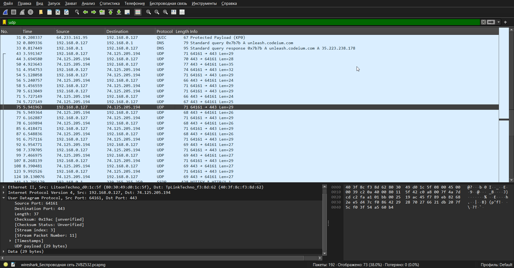
2. Определите длину (в байтах) для каждого поля UDP-заголовка, обращаясь к отображаемой информации о содержимом полей в данном пакете.
   - 2 байта
   - 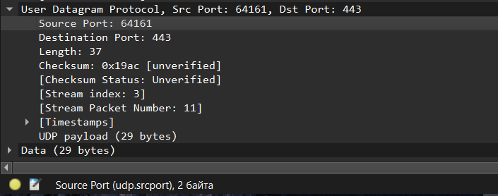
3. Значение в поле Length (Длина) – это длина чего?
   - Значение в поле Length показывает общую длину UDP-дейтаграммы в байтах, включая заголовок и данные
   - 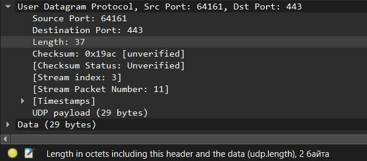
4. Какое максимальное количество байт может быть включено в полезную нагрузку UDP-пакета?
   - А вот вопрос размытый какой-то... А мы используем IPv4? Если да, то IP-заголовок в 20 байт надо учитывать. Ну, короче говоря, если его учитывать, то ответ следующий: $(2^{16} - 1) - 8 - 20 = 65507$ _(максимальный размер всего поля, размер UDP-заголовка, размер IP-заголовка)_
5. Чему равно максимально возможное значение номера порта отправителя?
   - $(2^{16} - 1) = 65535$ _(у нас соответствующее поле двухбайтовое, мы дальше уйти не сможем)_
6. Какой номер протокола для протокола UDP? Дайте ответ и для шестнадцатеричной и
   десятеричной системы. Чтобы ответить на этот вопрос, вам необходимо заглянуть в поле
   Протокол в IP-дейтаграмме, содержащей UDP-сегмент.
   - `17` в десятичной, `0x11` в шестнадцатеричной 
   - 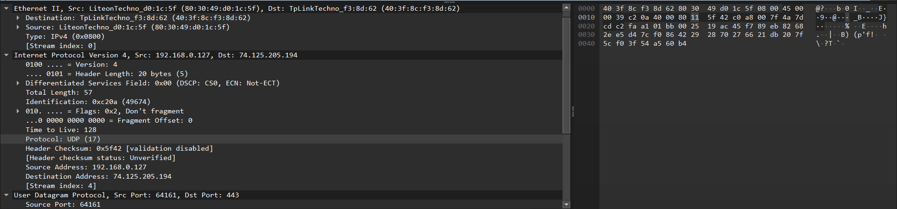
7. Проверьте UDP-пакет и ответный UDP-пакет, отправляемый вашим хостом. Определите отношение между номерами портов в двух пакетах.
   - Ну, местами они поменялись:
   - 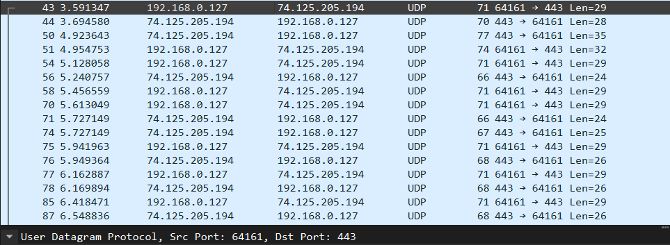
   - 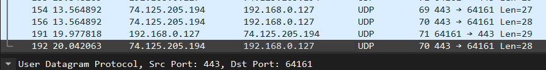

## Программирование. FTP

### FileZilla сервер и клиент (3 балла)
1. Установите сервер и клиент [FileZilla](https://filezilla.ru/get)
2. Создайте FTP сервер. Например, по адресу 127.0.0.1 и портом 21. 
   Укажите директорию по умолчанию для работы с файлами.
3. Создайте пользователя TestUser. Для простоты и удобства можете отключить использование сертификатов.
4. Запустите FileZilla клиента (GUI) и попробуйте поработать с файлами (создать папки,
добавить/удалить файлы).


#### Скрины

Я создал пользователя TestUser, которому разрешил входить без пароля. Он принадлежит группе lab06, у которой есть соответствие:
| Virtual path | Native path |
| ------------ | ----------- |
| /            | C:\FTPRoot  |

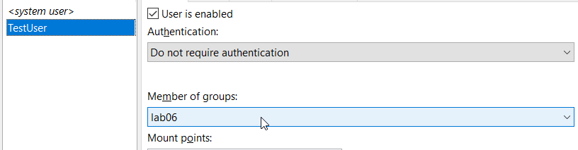
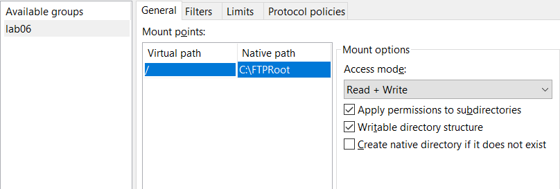

Подключимся к нашему FTP-серверу

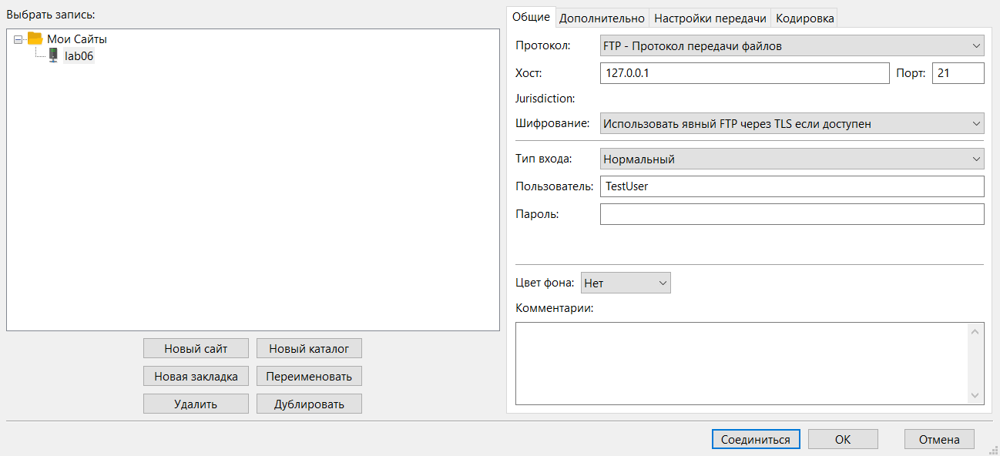

Сервер доволен:

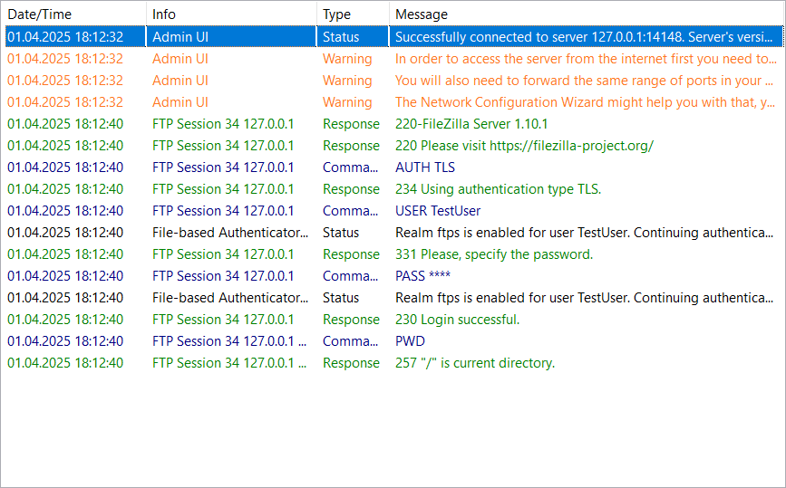

Создадим директорию:

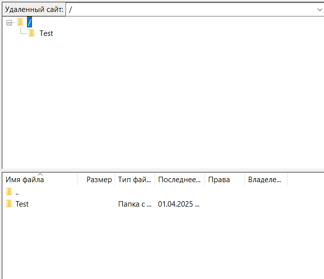

Закинем какой-нибудь локальный текстовый файл:

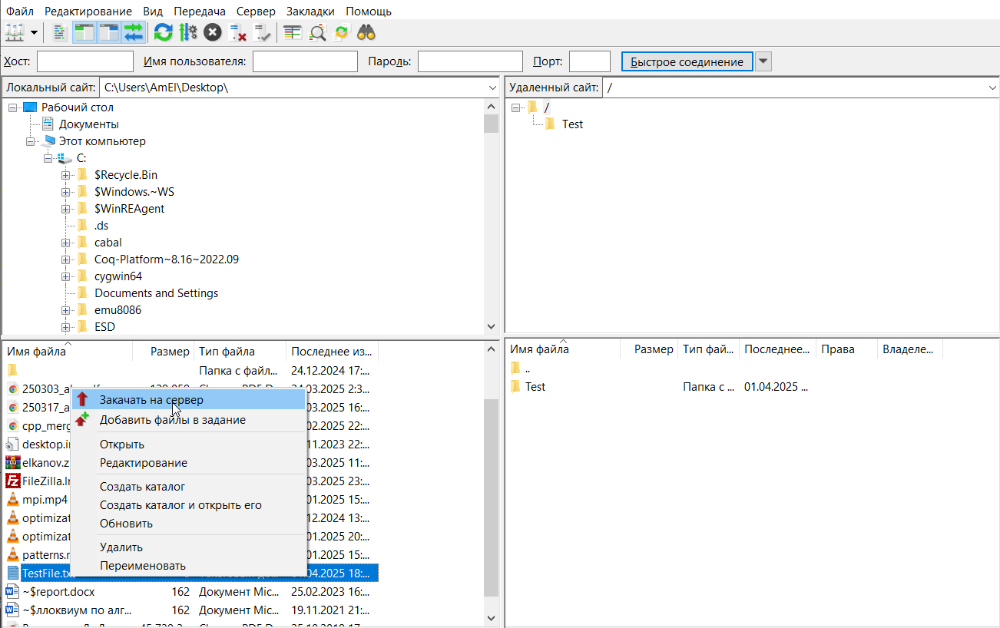

Откроем его, используя системную ассоциацию для .txt файлов (короче, используя блокнот)

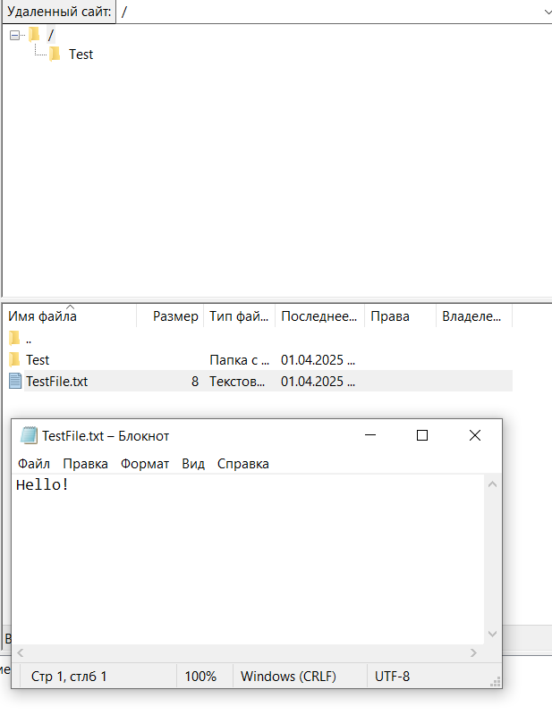

Почистим все, что насоздавали, и посмотрим, как дела у сервера:

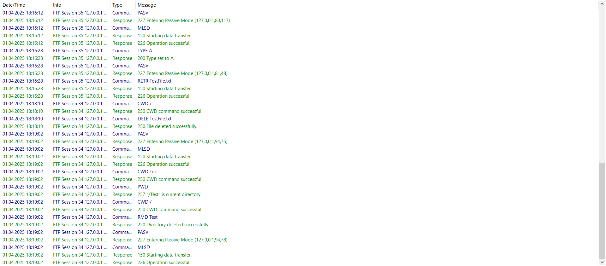

Все логи демо вместить, увы, не удалось, но суть в том, что серверу хорошо, и он все обрабатывает :)

### FTP клиент (3 балла)
Создайте консольное приложение FTP клиента для работы с файлами по FTP. Приложение может
обращаться к FTP серверу, созданному в предыдущем задании, либо к какому-либо другому серверу 
(есть много публичных ftp-серверов для тестирования, [вот](https://dlptest.com/ftp-test/) один из них).

Приложение должно:
- Получать список всех директорий и файлов сервера и выводить его на консоль
- Загружать новый файл на сервер
- Загружать файл с сервера и сохранять его локально

Бонус: Не используйте готовые библиотеки для работы с FTP (например, ftplib для Python), а реализуйте решение на сокетах **(+3 балла)**.

#### Демонстрация работы
Я написал FTP-клиент на сокетах. Буду проверять на [ftp-сервере для тестирования](https://dlptest.com/ftp-test/).

Зайдем на сам сервер _(пароль специально в консоли не показывается при вводе, так что не пугайтесь)_:

```
Enter FTP server address: ftp.dlptest.com
Enter username (default: anonymous): dlpuser
Enter password (default: anonymous@):
220 Welcome to the DLP Test FTP Server

Client: USER dlpuser
Server: 331 Please specify the password.
Client: PASS ***
Server: 230 Login successful.

Available commands: list, download, upload, quit (or CTRL+C)
...
```

Выведем изначальный список директорий и файлов:

```
Enter command: list
Client: PASV
Server: 227 Entering Passive Mode (44,241,66,173,4,123).
PASV response: 227 Entering Passive Mode (44,241,66,173,4,123).

Client: LIST
Server: 150 Here comes the directory listing.
Directory listing:
-rw-r--r--    1 1001     1001       135964 Apr 01 18:00 10.101.1.2_20250401-13593855_IVA.jpg
-rw-r--r--    1 1001     1001       127656 Apr 01 18:00 10.101.1.2_20250401-13594092_IVA.jpg
-rw-r--r--    1 1001     1001       140316 Apr 01 18:00 10.101.1.2_20250401-13594553_IVA.jpg
-rw-r--r--    1 1001     1001       125474 Apr 01 18:00 10.101.1.2_20250401-13594734_IVA.jpg
-rw-r--r--    1 1001     1001       123144 Apr 01 18:00 10.101.1.2_20250401-13595591_IVA.jpg
-rw-r--r--    1 1001     1001       122904 Apr 01 18:00 10.101.1.2_20250401-13595891_IVA.jpg
-rw-r--r--    1 1001     1001       120229 Apr 01 18:00 10.101.1.2_20250401-14000134_IVA.jpg
-rw-r--r--    1 1001     1001       144216 Apr 01 18:00 10.101.1.2_20250401-14000313_IVA.jpg
-rw-r--r--    1 1001     1001       138837 Apr 01 18:00 10.101.1.2_20250401-14000493_IVA.jpg
-rw-r--r--    1 1001     1001       122142 Apr 01 18:00 10.101.1.2_20250401-14001072_IVA.jpg
-rw-r--r--    1 1001     1001       130720 Apr 01 18:00 10.101.1.2_20250401-14001232_IVA.jpg
-rw-r--r--    1 1001     1001       136940 Apr 01 18:00 10.101.1.2_20250401-14013394_IVA.jpg
-rw-r--r--    1 1001     1001       139664 Apr 01 18:00 10.101.1.2_20250401-14013575_IVA.jpg
-rw-r--r--    1 1001     1001       134302 Apr 01 18:01 10.101.1.2_20250401-14014355_IVA.jpg
-rw-r--r--    1 1001     1001       138697 Apr 01 18:01 10.101.1.2_20250401-14014814_IVA.jpg
-rw-r--r--    1 1001     1001       138026 Apr 01 18:01 10.101.1.2_20250401-14014935_IVA.jpg
-rw-r--r--    1 1001     1001       127970 Apr 01 18:01 10.101.1.2_20250401-14015555_IVA.jpg
-rw-r--r--    1 1001     1001       119048 Apr 01 18:01 10.101.1.2_20250401-14020117_IVA.jpg
-rw-r--r--    1 1001     1001       138720 Apr 01 18:01 10.101.1.2_20250401-14020475_IVA.jpg
-rw-r--r--    1 1001     1001       139459 Apr 01 18:01 10.101.1.2_20250401-14020976_IVA.jpg
-rw-r--r--    1 1001     1001       133812 Apr 01 18:01 10.101.1.2_20250401-14021636_IVA.jpg
-rw-r--r--    1 1001     1001            0 Apr 01 18:01 10.101.1.2_20250401-14021935_IVA.jpg
-rw-r--r--    1 1001     1001     10485760 Apr 01 18:00 10mb.txt
-rw-r--r--    1 1001     1001      2417467 Apr 01 18:01 1_9270815244133824443_17-9ULspeedtest.upt
-rw-r--r--    1 1001     1001            0 Apr 01 18:00 20250401_180000_traffic_log.tar.gz
-rw-r--r--    1 1001     1001          260 Apr 01 18:01 HeartbeatData_b3b7_20250401234500.csv
-rw-r--r--    1 1001     1001          265 Apr 01 18:01 HeartbeatData_d3fb_20250401234500.csv
-rw-r--r--    1 1001     1001          262 Apr 01 18:00 HeartbeatData_d4fd_20250401234500.csv
-rw-r--r--    1 1001     1001          134 Apr 01 18:00 PY_THUYDIENSONGHINH_20250402_010000.txt
-rw-r--r--    1 1001     1001       100000 Apr 01 18:00 _11473792
-rw-r--r--    1 1001     1001        10000 Apr 01 18:00 _11477656
-rw-r--r--    1 1001     1001       100000 Apr 01 18:00 _11477664
-rw-r--r--    1 1001     1001       100000 Apr 01 18:00 _11478018
-rw-r--r--    1 1001     1001       100000 Apr 01 18:00 _11478020
-rw-r--r--    1 1001     1001       100000 Apr 01 18:00 _11478083

226 Directory send OK.
```

Загрузим туда текстовый файл:
```
Enter command: upload
Enter local filename to upload: C:\Users\AmEl\PycharmProjects\networks-course\lab06\src\data\1.txt
Enter remote filename to save as: halo.txt
Client: PASV
Server: 227 Entering Passive Mode (44,241,66,173,4,12).
PASV response: 227 Entering Passive Mode (44,241,66,173,4,12).

Client: STOR halo.txt
Server: 150 Ok to send data.
Upload complete. Remote file saved as: halo.txt
226 Transfer complete.
```

Загрузим туда картинку:
```
Enter command: upload
Enter local filename to upload: C:\Users\AmEl\PycharmProjects\networks-course\lab06\src\data\test_ftp_img.jpg
Enter remote filename to save as: halo.jpg
Client: PASV
Server: 227 Entering Passive Mode (44,241,66,173,4,111).
PASV response: 227 Entering Passive Mode (44,241,66,173,4,111).

Client: STOR halo.jpg
Server: 150 Ok to send data.
Upload complete. Remote file saved as: halo.jpg
226 Transfer complete.
```

Посмотрим на текущий list:
```
Enter command: list
Client: PASV
Server: 227 Entering Passive Mode (44,241,66,173,4,63).
PASV response: 227 Entering Passive Mode (44,241,66,173,4,63).

Client: LIST
Server: 150 Here comes the directory listing.
Directory listing:
-rw-r--r--    1 1001     1001       135964 Apr 01 18:00 10.101.1.2_20250401-13593855_IVA.jpg
...
-rw-r--r--    1 1001     1001        70176 Apr 01 18:03 10.101.1.2_20250401-14035124_IVA.jpg
-rw-r--r--    1 1001     1001     10485760 Apr 01 18:02 10mb.txt
-rw-r--r--    1 1001     1001     33103184 Apr 01 18:01 1_9270815244133824443_17-9ULspeedtest.upt
-rw-r--r--    1 1001     1001            0 Apr 01 18:00 20250401_180000_traffic_log.tar.gz
-rw-r--r--    1 1001     1001      1048576 Apr 01 18:02 FTP_UPLOAD_FILE_E4_4E_2D_CF_01_A0.txt
-rw-r--r--    1 1001     1001          260 Apr 01 18:01 HeartbeatData_b3b7_20250401234500.csv
-rw-r--r--    1 1001     1001          265 Apr 01 18:01 HeartbeatData_d3fb_20250401234500.csv
-rw-r--r--    1 1001     1001          262 Apr 01 18:00 HeartbeatData_d4fd_20250401234500.csv
-rw-r--r--    1 1001     1001          134 Apr 01 18:00 PY_THUYDIENSONGHINH_20250402_010000.txt
-rw-r--r--    1 1001     1001       100000 Apr 01 18:00 _11473792
-rw-r--r--    1 1001     1001        10000 Apr 01 18:00 _11477656
-rw-r--r--    1 1001     1001       100000 Apr 01 18:00 _11477664
-rw-r--r--    1 1001     1001       100000 Apr 01 18:00 _11478018
-rw-r--r--    1 1001     1001       100000 Apr 01 18:00 _11478020
-rw-r--r--    1 1001     1001       100000 Apr 01 18:00 _11478083
-rw-r--r--    1 1001     1001       194757 Apr 01 18:02 halo.jpg
-rw-r--r--    1 1001     1001            9 Apr 01 18:02 halo.txt
```

Видим, что наши файлы загрузились. Теперь попробуем скачать их обратно:

```
Enter command: download
Enter remote filename to download: halo.txt
Enter local filename to save as: yoooo.txt
Client: PASV
Server: 227 Entering Passive Mode (44,241,66,173,4,78).
PASV response: 227 Entering Passive Mode (44,241,66,173,4,78).

Client: RETR halo.txt
Server: 150 Opening BINARY mode data connection for halo.txt (9 bytes).
Download complete. Local file saved as: yoooo.txt
226 Transfer complete.
```

```
Enter command: download
Enter remote filename to download: halo.jpg
Enter local filename to save as: yooo.jpg
Client: PASV
Server: 227 Entering Passive Mode (44,241,66,173,4,87).
PASV response: 227 Entering Passive Mode (44,241,66,173,4,87).

Client: RETR halo.jpg
Server: 150 Opening BINARY mode data connection for halo.jpg (194757 bytes).
Download complete. Local file saved as: yooo.jpg
226 Transfer complete.
```

Видим, что скачались они без каких-либо корраптов:
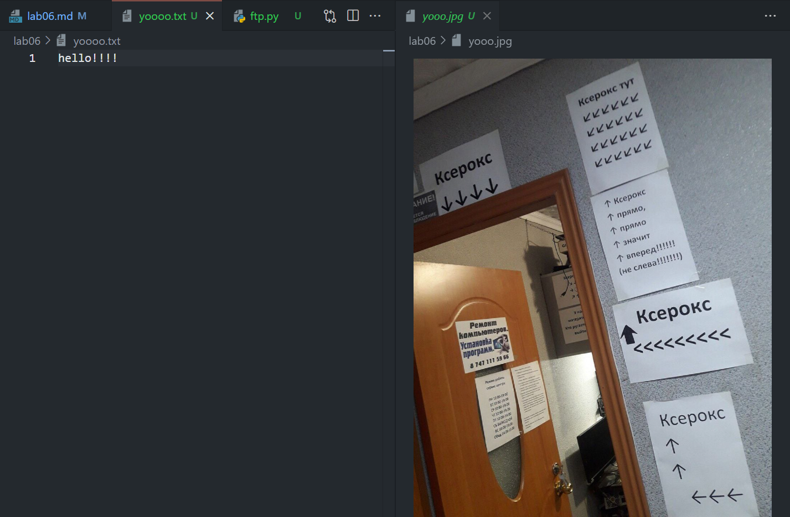

Ну и выходим из клиента:
```
Enter command: quit
Client: QUIT
Server: 221 Goodbye.
```

### GUI FTP клиент (4 балла)
Реализуйте приложение FTP клиента с графическим интерфейсом. НЕ используйте C#.

Возможный интерфейс:


В приложении должна быть поддержана следующая функциональность:
- Выбор сервера с указанием порта, логин и пароль пользователя и возможность
подключиться к серверу. При подключении на экран выводится список всех доступных
файлов и директорий
- Поддержаны CRUD операции для работы с файлами. Имя файла можно задавать из
интерфейса. При создании нового файла или обновлении старого должно открываться
окно, в котором можно редактировать содержимое файла. При команде Retrieve
содержимое файла можно выводить в главном окне.

#### Демонстрация работы
todo

### FTP сервер (5 баллов)
Реализуйте свой FTP сервер, который работает поверх TCP сокетов. Вы можете использовать FTP клиента, реализованного на прошлом этапе, для тестирования своего сервера.
Сервер должен реализовать возможность авторизации (с указанием логина/пароля) и поддерживать команды:
- CWD
- PWD
- PORT
- NLST
- RETR
- STOR
- QUIT

#### Демонстрация работы
todo
