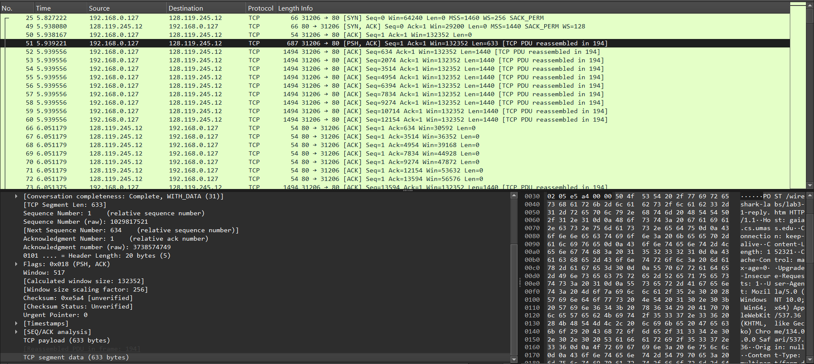
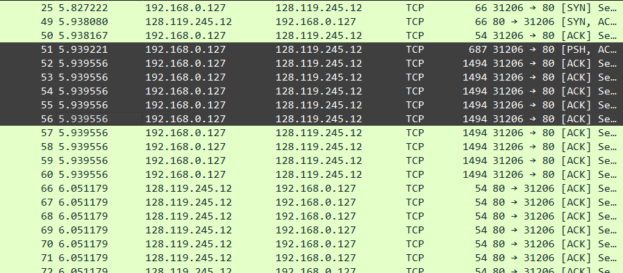

# Практика 7. Транспортный уровень

## Wireshark: TCP (5 баллов)

### Перехват TCP-передачи данных от вашего компьютера удаленному серверу
При ответе на вопросы прикладывайте соответствующие скрины программы Wireshark.

#### Подготовка
1. Откройте веб-браузер и перейдите по ссылке gaia.cs.umass.edu/wireshark-labs/alice.txt.
   Здесь вы найдете копию книги «Алиса в стране чудес» в формате ASCII. Сохраните этот файл 
   на свой компьютер.
2. Перейдите по ссылке: gaia.cs.umass.edu/wireshark-labs/TCP-wireshark-file1.html. Сюда вы
   будете загружать ранее сохраненный файл.
3. Запустите Wireshark и начните перехват пакетов.
4. Теперь загрузите текстовый файл «Алиса в стране чудес» на указанной в п.2 страничке.
5. Остановите захват пакетов в приложении Wireshark. Используйте фильтр пакетов tcp.

#### Вопросы
1. Какой IP-адрес и номер порта TCP использует ваш компьютер (отправитель), передающий файл серверу gaia.cs.umass.edu? Для ответа на вопрос, возможно, проще выбрать http-сообщение и рассмотреть информацию TCP-пакета, используемого для передачи этого http-сообщения,  в окне деталей заголовка пакета.
   - IP-адрес: `192.168.0.127`, порт: `31206`
   - 
2. Каков IP-адрес у сервера gaia.cs.umass.edu? Каковы номера портов для отправки и приема TCP-сегментов этого соединения?
   - IP-адрес: `128.119.245.12`
   - Насчет номеров портов немного не понял: ну, удаленный сервер использует порт `80`, мы используем `31206` во время общения
   - 
3. Какой порядковый номер у SYN TCP-сегмента, который используется для установления TCP-соединения между компьютером клиента и сервером gaia.cs.umass.edu? Как определяется, что это именно SYN-сегмент?
   - За это отвечает `Sequence Number`. Если мы говорим о raw значении, то ответом здесь будет `1029817520`, если относительное, то `0` _(оно, по-моему, в реальном мире не существует, а его вычисляет Wireshark, чтобы было удобнее работать)_
   - Нам об этом говорит проставленный SYN-флаг и непроставленный ACK-флаг
   - 
4. Какой порядковый номер у SYNACK-сегмента, отправленного сервером gaia.cs.umass.edu
   на компьютер клиента в ответ на SYN-сегмент? Какое значение хранится в поле
   подтверждения в SYNACK-сегменте? Как сервер gaia.cs.umass.edu определил это значение?
   Как определяется, что это именно SYNACK-сегмент?
   - `seq`: Raw: `3738574748`, relative: `0`
   - `ACKnum`: Raw: `1029817521`, relative: `1`
   - Ну, сервер gaia.cs.umass.edu следует трех-шаговому рукопожатию в TCP, поэтому, после получения SYN TCP-сегмента, он знает, что `ACKnum = seq + 1`
   - Нам об этом говорят проставленные SYN-флаг и ACK-флаг
   - 
5. Какой порядковый номер у TCP-сегмента, содержащего команду POST протокола HTTP?
   (для нахождения команды POST вам потребуется проникнуть внутрь поля содержимого
   пакета в нижней части окна Wireshark, чтобы найти сегмент, в поле DATA которого
   хранится значение POST)
   - `seq`: Raw: `1029817521`, relative: `1`
   - 
6. Рассмотрите TCP-сегмент, содержащий команду POST протокола HTTP, как первый TCP-сегмент 
   соединения. Какие порядковые номера у первых шести сегментов TCP-соединения 
   (включая сегмент, содержащий команду POST протокола HTTP)? Когда был
   отправлен каждый сегмент? Когда был получен ACK-пакет для каждого сегмента?
   Покажите разницу между тем, когда каждый TCP-сегмент был отправлен и когда было
   получено каждое подтверждение, чему равно значение RTT для каждого из 6 сегментов?
   - `seq` у первых шести сегментов, начиная с сегмента, содержащего команду POST протокола HTTP:
     - Raw: `1029817521`, relative: `1`
     - Raw: `1029818154`, relative: `634`
     - Raw: `1029819594`, relative: `2074`
     - Raw: `1029821034`, relative: `3514`
     - Raw: `1029822474`, relative: `4954`
     - Raw: `1029823914`, relative: `6394`
   - Время отправки этих же сегментов в секундах (относительно начала захвата пакетов):
     - `5.939221`
     - `5.939556`
     - `5.939556`
     - `5.939556`
     - `5.939556`
     - `5.939556`
     
     - 
   - Время получения подтверждений этих же сегментов в секундах (относительно начала захвата пакетов):
     - `6.051179`
     - `6.051179`
     - `6.051179`
     - `6.051179`
     - `6.051179`
     - `6.051179`
     - 

   - Знаем, что RTT - это время прохождения пути от клиента сервера и обратно для небольшого пакета. Тогда:
     - `6.051179 - 5.939221 = 0.112958`
     - `6.051179 - 5.939556 = 0.111623`
     - `6.051179 - 5.939556 = 0.111623`
     - `6.051179 - 5.939556 = 0.111623`
     - `6.051179 - 5.939556 = 0.111623`
     - `6.051179 - 5.939556 = 0.111623`

7. Чему равна пропускная способность (количество байтов, передаваемых в единицу
   времени) для этого TCP-соединения? Объясните, как вы получили это значение.
   - Я очень много перерыл. Обычно все крутится около `какое-то количество байт/промежуток времени`
   - Насчет времени: 
     - Ну, можно смотреть на разницу `last data time` - `first data time` = `6.283691 - 5.939221 = 0.34447`с 
   - Насчет количества байт трудно сказать:
     - Если мы на прикладном уровне, то нас только размер файла интересует: `152138 байт`. А если выше по уровням смотреть, то там хэдеры добавляют свой объем. Мы данные бьем на сегменты по 1440 байт (+остаток от деления), потом к каждому из них прибавляем вес заголовков.
   - Ну давайте считать, что нас только полезный объем интересует:
     - $\frac{152138}{0.34447} \approx 4.4 * 10^5$ байт/с

### Работа с Time-Sequence-Graph (Stevens) (2 балла)
Time-Sequence-Graph (Stevens) (Временная шкала (Стивенса)) – одна из графических утилит
Wireshark для протокола TCP. Для того, чтобы ее запустить, выберите TCP-сегмент в окне
захваченных полученных пакетов. Затем выберите команду меню Statistics => TCP Stream Graph =>
Time-Sequence-Graph (Stevens) (Статистика => График TCP потока => Временная шкала (Стивенса)).
Каждая точка представляет отправленный TCP-сегмент, на графике изображена зависимость
порядкового номера сегмента от времени, когда он был отправлен.

#### Подготовка (такая же, как в предыдущем задании)
1. Откройте веб-браузер и перейдите по ссылке gaia.cs.umass.edu/wireshark-labs/alice.txt.
   Здесь вы найдете копию книги «Алиса в стране чудес» в формате ASCII. Сохраните этот файл на
   свой компьютер.
2. Перейдите по ссылке: gaia.cs.umass.edu/wireshark-labs/TCP-wireshark-file1.html. Сюда вы
   будете загружать ранее сохраненный файл.
3. Запустите Wireshark и начните перехват пакетов
4. Теперь загрузите текстовый файл «Алиса в стране чудес» на указанной в п.2 страничке
5. Остановите захват пакетов в приложении Wireshark. Используйте фильтр пакетов tcp.

#### Задание
Используйте инструмент построения графиков Time-Sequence-Graph (Stevens), чтобы представить
изменение порядковых номеров на временной шкале для сегментов, отправленных от клиента
серверу gaia.cs.umass.edu. Приложите соответствующий скрин программы Wireshark.

#### Скрин


## Программирование. Эхо-запросы через UDP
Реализуйте сервер для пингования, а также его клиента.

### Пролог
Реализовал сервер и клиент, но без heartbeat части. Аргументов никаких нет, логирования тоже. На этот раз простенько решил выводить в консоль.

### А. Серверная часть (2 балла) - DONE
Сервер находится в бесконечном цикле, ожидая приходящие UDP-пакеты.
Если пакет прибывает, то сервер просто изменяет символы входящего сообщения на заглавные и
отправляет их обратно клиенту. Серверный код должен моделировать 20% потерю пакетов.

### Б. Клиентская часть (2 балла) - DONE
Клиент должен отправить 10 эхо-запросов серверу. Поскольку UDP является ненадежным с точки
зрения доставки протоколом, то пакет, отправленный от клиента к серверу или наоборот, может
быть потерян в сети. Так как клиент не может бесконечно ждать ответа на запрос, нужно задать
период ожидания ответа (тайм-аут), равный одной секунде – если ответ не будет получен в
течение одной секунды, клиентская программа должна предполагать, что пакет потерян.

Ваша клиентская программа должна:
- отправить эхо-запрос, используя UDP
- распечатать ответное сообщение от сервера (если такое есть)
- вычислить и вывести на печать время оборота (RTT) в секундах для каждого пакета при
ответе сервера
- в противном случае, вывести сообщение «Request timed out»

Формат сообщения:
`Ping номер_последовательности время`
- номер_последовательности начинается с 1 и увеличивается до 10 для каждого
последующего сообщения, отправленного клиентом
- время – это момент времени, когда клиент отправляет сообщение

Сделайте скриншоты, подтверждающие корректную работу вашей программы пингования со стороны клиента.

### В. Вывод в формате ping (2 балла) - DONE
Версия клиента из предыдущей части (Б) вычисляет время оборота для каждого пакета и выводит
его отдельно. Измените вывод таким образом, чтобы он соответствовал тому, как это делается в
стандартной утилите ping.

Для этого вам нужно будет сообщить минимальное, максимальное и среднее значение RTT в
конце каждого ответа от сервера. Дополнительно вычислите коэффициент потери пакетов (в
процентах).

#### Демонстрация работы
```
> python client.py
Pinging localhost [127.0.0.1] with 10 packets:
Reply from localhost: seq=1 time=1.00 ms
Reply from localhost: seq=2 time=1.01 ms
Reply from localhost: seq=3 time=0.00 ms
Reply from localhost: seq=4 time=0.99 ms
Request timed out for seq=5
Reply from localhost: seq=6 time=0.87 ms
Reply from localhost: seq=7 time=0.85 ms
Reply from localhost: seq=8 time=1.01 ms
Reply from localhost: seq=9 time=0.00 ms
Request timed out for seq=10

Ping statistics for 127.0.0.1:
        Packets: Sent = 10, Received = 8, Lost = 2 (20.0% loss)
Approximate round trip times in milliseconds:
        Minimum = 0.00ms, Maximum = 1.01ms, Average = 0.72ms
```

Тем временем сервер:
```
Received message from ('127.0.0.1', 58890)
Sent reply to ('127.0.0.1', 58890)
Received message from ('127.0.0.1', 58890)
Sent reply to ('127.0.0.1', 58890)
Received message from ('127.0.0.1', 58890)
Sent reply to ('127.0.0.1', 58890)
Received message from ('127.0.0.1', 58890)
Sent reply to ('127.0.0.1', 58890)
Received message from ('127.0.0.1', 58890)
Simulating packet loss. Packet from ('127.0.0.1', 58890) dropped.
Received message from ('127.0.0.1', 58890)
Sent reply to ('127.0.0.1', 58890)
Received message from ('127.0.0.1', 58890)
Sent reply to ('127.0.0.1', 58890)
Received message from ('127.0.0.1', 58890)
Sent reply to ('127.0.0.1', 58890)
Received message from ('127.0.0.1', 58890)
Sent reply to ('127.0.0.1', 58890)
Received message from ('127.0.0.1', 58890)
Simulating packet loss. Packet from ('127.0.0.1', 58890) dropped.
````

### Г. UDP Heartbeat (4 балла)
UDP Heartbeat (монитор доступности) подобен программе пингования. Он может быть
использован для проверки, работает ли приложение, и вывода сообщения об односторонней
потере пакетов.

Клиент отправляет порядковый номер и текущую временную метку в пакете UDP на сервер,
который слушает «сердцебиение» (т.е. ожидает UDP-пакеты) клиента. После получения пакетов
сервер вычисляет разницу во времени и сообщает о потерях. Если пакеты отсутствуют
определенный период времени, заданный параметром, то делается предположение, что
клиентское приложение остановлено и соответствующее сообщение выводится на консоль
сервера.

Реализуйте UDP Heartbeat (обе части – клиент и сервер), доработав обе ваши части программы
пингования из заданий А и Б.

Обратите внимание, что клиентов у сервера может быть сразу несколько одновременно.
Протестируйте такой сценарий.

#### Демонстрация работы
todo

## Задачи

### Задача 1 (3 балла)
Рассмотрим протоколы GBN и SR. Предположим, пространство порядковых номеров имеет размер $k$.

Постановка задачи: найти наибольшее допустимое окно передачи, которое позволит обойти
возникновение проблемы, показанной на рисунке для каждого из этих протоколов?


Описание проблемы:
Отсутствие синхронизации между окнами отправителя и получателя имеет важные последствия,
когда мы сталкиваемся с ограниченностью диапазона порядковых номеров. Рассмотрим, что
могло бы произойти, например, если у нас есть четыре пакета с порядковыми номерами 0, 1, 2, 3,
а размер окна равен трем. Предположим, пакеты с 0 по 2 переданы отправителем, корректно
получены и подтверждены получателем. В этот момент окно получателя заполняется четвертым,
пятым и шестым пакетами, которые имеют порядковые номера 3, 0 и 1, соответственно. Теперь
рассмотрим два сценария.

В первом сценарии (на рисунке сверху) квитанции ACK на первые три пакета доставлены верно.
Таким образом, отправитель сдвигает окно вперед и отправляет четвертый, пятый и шестой
пакеты с порядковыми номерами 3, 0 и 1 соответственно.
Пакет с порядковым номером 3 потерян, но пакет с порядковым номером 0, **содержащий новые данные**, 
получен.

Во втором случае (рисунок снизу) ACK пакеты для первых трех пакетов данных потеряны, и
отправитель пересылает эти пакеты. Таким образом, получатель далее получает пакет с
порядковым номером 0 — **копию первого отправленного**.
Теперь рассмотрим ту же ситуацию с точки зрения принимающей стороны. Действия,
выполняемые передающей стороной, скрыты от нее; принимающая сторона способна лишь
следить за последовательностями получаемых пакетов и генерируемых квитанций. Подобная
ограниченность приводит к тому, что обе описанные выше ситуации воспринимаются
принимающей стороной как одинаковые. Она не может отличить исходную передачу пакета от
повторной.

#### Решение
todo

### Задача 2 (2 балла) - DONE
Представим себе следующую ситуацию: один хост расположен в Санкт-Петербурге, а другой — во
Владивостоке. Пусть время оборота RTT между этими двумя хостами приблизительно равно $30$ мс.
Предположим далее, что хосты соединены каналом со скоростью передачи $R$, равной $1$ Гбит/с
($10^9$ бит/с).

Предположим, что размер передаваемого пакета составляет $1500$ байт, включая поля
заголовка и данные.

Насколько большим должен быть размер окна $n$, чтобы использование канала составило
более $98$ процентов?

#### Решение
Чтобы загрузка канала была не менее 98%, требуется:
$$
   \frac{n * L}{RTT} \geq 0.98 * R
$$
Значит:
$$
   n \geq \frac{0.98 * R * RTT}{L} = \frac{0.98 * 0.03 * 10^9}{1500 * 8} ~ 2450
$$
Т.е., чтобы канал был загружен более чем на 98%, скользящее окно должно быть не меньше 2450 пакетов.
