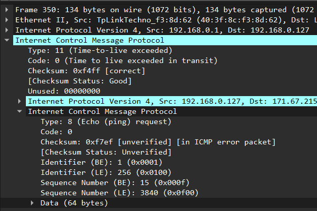

# Практика 9. Сетевой уровень

## Wireshark: ICMP
В лабораторной работе предлагается исследовать ряд аспектов протокола ICMP:
- ICMP-сообщения, генерируемые программой Ping
- ICMP-сообщения, генерируемые программой Traceroute
- Формат и содержимое ICMP-сообщения

### 1. Ping (4 балла)
Программа Ping на исходном хосте посылает пакет на целевой IP-адрес; если хост с этим адресом
активен, то программа Ping на нем откликается, отсылая ответный пакет хосту, инициировавшему
связь. Оба этих пакета Ping передаются по протоколу ICMP.

Выберите какой-либо хост, расположенный на другом континенте (например, в Америке или
Азии). Захватите с помощью Wireshark ICMP пакеты от утилиты ping.
Для этого из командной строки запустите команду (аргумент `-n 10` означает, что должно быть
отослано 10 ping-сообщений): `ping –n 10 host_name`

Для анализа пакетов в Wireshark введите строку icmp в области фильтрации вывода.

Буду тестировать на американском хосте `stanford.edu`.
#### Вопросы
1. Каков IP-адрес вашего хоста? Каков IP-адрес хоста назначения?
   - Source Address: 192.168.0.127
   - Destination Address: 171.67.215.200
2. Почему ICMP-пакет не обладает номерами исходного и конечного портов?
   - Номера портов являются особенностью протоколов транспортного уровня, таких как TCP и UDP. ICMP является частью сетевого уровня (IP),поэтому этот атрибут не существует на этом уровне
3. Рассмотрите один из ping-запросов, отправленных вашим хостом. Каковы ICMP-тип и кодовый
   номер этого пакета? Какие еще поля есть в этом ICMP-пакете? Сколько байт приходится на поля 
   контрольной суммы, порядкового номера и идентификатора?
   - `Type: 8 (Echo (ping) request)`, `Code: 0`
   - `Checksum`, `Identifier (BE / LE)`, `Sequence Number (BE / LE)` _(`BE` - big endian / `LE` - little endian; видимо, wireshark выводит данные в разных порядках для лучшей читабельности)_, `Data`
   - 6 байт (по 2 байта на каждое поле)
   - 
4. Рассмотрите соответствующий ping-пакет, полученный в ответ на предыдущий. 
   Каковы ICMP-тип и кодовый номер этого пакета? Какие еще поля есть в этом ICMP-пакете? 
   Сколько байт приходится на поля контрольной суммы, порядкового номера и идентификатора?
   - `Type: 0 (Echo (ping) reply)`, `Code: 0`
   - `Checksum`, `Identifier (BE / LE)`, `Sequence Number (BE / LE)`, `Data`
   - 6 байт
   - 

### 2. Traceroute (4 балла)
Программа Traceroute может применяться для определения пути, по которому пакет попал с
исходного на конечный хост.

Traceroute отсылает первый пакет со значением TTL = 1, второй – с TTL = 2 и т.д. Каждый
маршрутизатор понижает TTL-значение пакета, когда пакет проходит через этот маршрутизатор.
Когда на маршрутизатор приходит пакет со значением TTL = 1, этот маршрутизатор отправляет
обратно к источнику ICMP-пакет, свидетельствующий об ошибке.

Задача – захватить ICMP пакеты, инициированные программой traceroute, в сниффере Wireshark.
В ОС Windows вы можете запустить: `tracert host_name`

Выберите хост, который **расположен на другом континенте**.

#### Вопросы
1. Рассмотрите ICMP-пакет с эхо-запросом на вашем скриншоте. Отличается ли он от ICMP-пакетов
   с ping-запросами из Задания 1 (Ping)? Если да – то как?
   - Ну, теперь `Data` занимает 64 байта, а еще в IP-header'е `TTL=1`
2. Рассмотрите на вашем скриншоте ICMP-пакет с сообщением об ошибке. В нем больше полей,
   чем в ICMP-пакете с эхо-запросом. Какая информация содержится в этих дополнительных полях?
   - IPv4 и ICMP данные исходного эхо-запроса, который не дошел из-за истечения TTL и поле `unused`.
   - 
3. Рассмотрите три последних ICMP-пакета, полученных исходным хостом. Чем эти пакеты
   отличаются от ICMP-пакетов, сообщающих об ошибках? Чем объясняются такие отличия?
   - Ну, тем, что они хорошенькие: Тип хороший `0 (Echo (ping) reply)`, а также нет полей, которые дали бы информацию о запросе, который вызвал ошибку
   - Тем, что они дошли до точки назначения, а не были развернуты обратно промежуточным маршрутизатором из-за ttl exceeded
   - 
4. Есть ли такой канал, задержка в котором существенно превышает среднее значение? Можете
   ли вы, опираясь на имена маршрутизаторов, определить местоположение двух маршрутизаторов,
   расположенных на обоих концах этого канала?
   - Ну... Чтобы прям одного и чтобы прям превышал не видится
   - 
   - Ну давайте предположим, что для 12-13. Посмотрим, где находятся эти два маршрутизатора:
     - Один в Palo Alto: https://www.ip2location.com/demo/184.105.177.238
     - Другой в Stanford: https://www.ip2location.com/demo/171.64.255.196

## Программирование.

### 1. IP-адрес и маска сети (1 балл)
Напишите консольное приложение, которое выведет IP-адрес вашего компьютера и маску сети на консоль.

#### Демонстрация работы
Перед началом нужно установить `pip install netifaces`
Добавил еще возможность глядеть по всем интерфейсам, а не только дефолтный:

```
amir@DESKTOP-V9NBEAG:/mnt/c/Users/AmEl/PycharmProjects/networks-course/lab09$ python3 src/my_ip.py -h
usage: Get IP address and netmask in following format: 
<interface>     IP: <ip> Netmask: <mask> [-h] [-a]     

options:
  -h, --help            show this help message and exit
  -a, --all-interfaces  show for all interfaces        
amir@DESKTOP-V9NBEAG:/mnt/c/Users/AmEl/PycharmProjects/networks-course/lab09$ python3 src/my_ip.py
eth0    IP: 172.21.216.156  Netmask: 255.255.240.0
amir@DESKTOP-V9NBEAG:/mnt/c/Users/AmEl/PycharmProjects/networks-course/lab09$ python3 src/my_ip.py -a
lo      IP: 127.0.0.1  Netmask: 255.0.0.0
eth0    IP: 172.21.216.156  Netmask: 255.255.240.0
```

### 2. Доступные порты (2 балла)
Выведите все доступные (свободные) порты в указанном диапазоне для заданного IP-адреса. 
IP-адрес и диапазон портов должны передаваться в виде входных параметров.

#### Демонстрация работы
```
usage: portscan.py [-h] [--host HOST] [-s START] [-e END] [-t TIMEOUT]

TCP port scanner

options:
  -h, --help            show this help message and exit
  --host HOST           Target hostname or IP address
  -s START, --start START
                        First port to scan (inclusive)
  -e END, --end END     Last port to scan (exclusive)
  -t TIMEOUT, --timeout TIMEOUT
                        Connection timeout in seconds
```

Когда есть порты:
```
amir@DESKTOP-V9NBEAG:/mnt/c/Users/AmEl/PycharmProjects/networks-course/lab09$ python3 src/portscan.py --host=cpp-cactus-25.ru -s=10000 -e=1002020 open ports on cpp-cactus-25.ru in range [10000, 10020) were found:
10000, 10001, 10002, 10003, 10004, 10005, 10006, 10007, 10008, 10009, 10010, 10011, 10012, 10013, 10014, 10015, 10016, 10017, 10018, 10019 
```

Когда нет портов:
```
amir@DESKTOP-V9NBEAG:/mnt/c/Users/AmEl/PycharmProjects/networks-course/lab09$ python3 src/portscan.py -s=10000 -e=10020
All ports in range [10000, 10020) are closed on 127.0.0.1
```

### 3. Широковещательная рассылка для подсчета копий приложения (6 баллов)
Разработать приложение, подсчитывающее количество копий себя, запущенных в локальной сети.
Приложение должно использовать набор сообщений, чтобы информировать другие приложения
о своем состоянии. После запуска приложение должно рассылать широковещательное сообщение
о том, что оно было запущено. Получив сообщение о запуске другого приложения, оно должно
сообщать этому приложению о том, что оно работает. Перед завершением работы приложение
должно информировать все известные приложения о том, что оно завершает работу. На экран
должен выводиться список IP адресов компьютеров (с указанием портов), на которых приложение
запущено.

Приложение считает другое приложение запущенным, если в течение промежутка времени,
равного нескольким интервалам между рассылками широковещательных сообщений, от него
пришло сообщение.

**Такое приложение может быть использовано, например, при наличии ограничения на
количество лицензионных копий программ.*

Пример GUI:


#### Демонстрация работы
todo

## Задачи. Работа протокола TCP

### Задача 1. Докажите формулы (3 балла)
Пусть за период времени, в который изменяется скорость соединения с $\frac{W}{2 \cdot RTT}$
до $\frac{W}{RTT}$, только один пакет был потерян (очень близко к концу периода).
1. Докажите, что частота потери $L$ (доля потерянных пакетов) равна
   $$L = \dfrac{1}{\frac{3}{8} W^2 + \frac{3}{4} W}$$
2. Используйте выше полученный результат, чтобы доказать, что, если частота потерь равна
   $L$, то средняя скорость приблизительно равна
   $$\approx \dfrac{1.22 \cdot MSS}{RTT \cdot \sqrt{L}}$$

#### Решение
todo

### Задача 2. Найдите функциональную зависимость (3 балла)
Рассмотрим модификацию алгоритма управления перегрузкой протокола TCP. Вместо
аддитивного увеличения, мы можем использовать мультипликативное увеличение. 
TCP-отправитель увеличивает размер своего окна в небольшую положительную 
константу $a$ ($a > 1$), как только получает верный ACK-пакет.
1. Найдите функциональную зависимость между частотой потерь $L$ и максимальным
размером окна перегрузки $W$.
2. Докажите, что для этого измененного протокола TCP, независимо от средней пропускной
способности, TCP-соединение всегда требуется одинаковое количество времени для
увеличения размера окна перегрузки с $\frac{W}{2}$ до $W$.

#### Решение
todo
