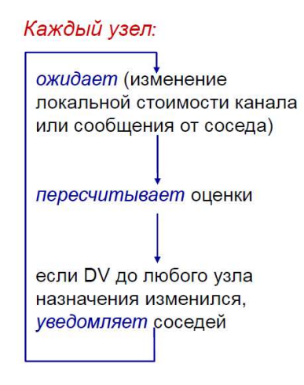
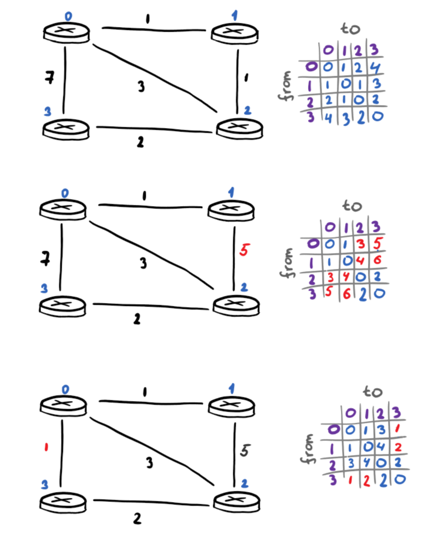

# Практика 11. Сетевой уровень

## Трассировка маршрута с использованием ICMP (8 баллов)
Трассировка осуществляется посредством сообщений протокола ICMP. Эхо-запрос 
(ICMP-сообщение с типом «8») отправляется одному и тому же хосту назначения с увеличением с
каждым шагом значения поля TTL (времени жизни) на единицу. Маршрутизаторы на пути
следования пакета возвращают обратно запрашивающему хосту ICMP-сообщение об истечении
времени (ICMP-сообщение с типом «11»), когда поле TTL становится равным нулю. При
достижении хоста назначения тот в ответ отправляет ICMP-сообщение с типом «0» (эхо-ответ). Из
полученных ответов можно извлечь IP-адреса всех маршрутизаторов на пути следования пакета, а
также время оборота (RTT) до каждого из узлов на маршруте.

**Не используйте готовые библиотеки для работы с ICMP**, предложите свое решение на сокетах.

### Задание А. Основное приложение (6 баллов)
Основная задача – разработать свое собственное (клиентское) приложение трассировки, которое
будет использовать протокол ICMP.
Должен быть выведен на консоль список IP-адресов всех маршрутизаторов на пути от источника к
хосту назначения. Количество сообщений, которые будут отправляться каждому маршрутизатору,
должно настраиваться параметром и по каждому из пакетов должно выводиться время RTT (по
умолчанию утилита tracert использует три пакета).

### Задание Б. Вывод имен промежуточных узлов (2 балла)
В настоящее время приложение выводит только список IP-адресов всех маршрутизаторов на пути
от источника к хосту назначения. Попробуйте использовать метод (например, gethostbyname) для
получения имени каждого промежуточного узла маршрута и выводить также на консоль это имя.
Предоставьте скриншот результатов трассировки какого-либо хоста.

#### Пролог
Ну, tracert написан. Пытался приблизиться к оригиналу по виду. Вот `--help` программы:

```
usage: main.py [-h] [-m MAX_HOPS] [-p PROBES] [-w WAIT] host

tracert using ICMP echo requests

positional arguments:
  host                  Destination host to trace route to

options:
  -h, --help            show this help message and exit
  -m MAX_HOPS, --max-hops MAX_HOPS
                        Max hops (max TTL to be reached)
  -p PROBES, --probes PROBES
                        Number of probes per hop
  -w WAIT, --wait WAIT  Timeout to wait for each reply (in seconds)
```

#### Демонстрация работы
```
> python .\src_tracert\main.py stanford.edu
Tracing route to stanford.edu [171.67.215.200] 
over a maximum of 30 hops with 3 probes each:

  1       2 ms    1 ms    1 ms  192.168.0.1
  2      11 ms    4 ms    3 ms  5.3.25.80
  3       4 ms    5 ms    3 ms  5.3.25.81
  4      14 ms   16 ms   13 ms  msk-ix.ertelecom.ru [195.208.209.132]
  5          *   31 ms       *  mskix.he.net [195.208.210.40]
  6      35 ms       *       *  port-channel4.core3.sto1.he.net [184.104.192.81]
  7      42 ms   44 ms       *  port-channel5.core3.cph1.he.net [72.52.92.128]
  8     117 ms  121 ms  117 ms  port-channel4.core2.ewr5.he.net [184.104.189.25]
  9          *  120 ms  119 ms  port-channel24.core3.nyc4.he.net [184.104.188.252]
 10     181 ms       *       *  port-channel9.core3.sjc2.he.net [184.104.199.21]
 11          *       *       *  Request timed out.
 12     179 ms  182 ms  180 ms  stanford-university.e0-62.core2.pao1.he.net [184.105.177.238]
 13     179 ms  178 ms  178 ms  campus-ial-nets-a-vl1002.SUNet [171.64.255.196]
 14          *       *       *  Request timed out.
 15     181 ms  180 ms  181 ms  web.stanford.edu [171.67.215.200]

Trace complete.
```

## Дистанционно-векторная маршрутизация (8 баллов)
Реализуйте распределенный алгоритм дистанционно-векторной маршрутизации для сети,
изображенной на рисунке


Каждый узел знает лишь о своих соседях, однако не имеет полной информации обо всей сети.

Все каналы являются двунаправленными, стоимости каналов идентичны в обоих направлениях.
При изменении стоимости каналов (расстояний до соседних узлов) узел должен разослать новый
вектор стоимостей (пакет) всем своим соседям.

Если в результате обновления изменяется стоимость маршрута, например, от узла 0 до какого-либо 
узла сети, узел 0 информирует об этом всех своих непосредственных соседей, посылая им пакет.

В дистанционно-векторном алгоритме пакетами с информацией о маршрутах обмениваются
только соседние узлы. Таким образом, узлы 1 и 2 будут обмениваться пакетами, а узлы 1 и 3 – нет.

### Задание А (6 баллов)
Реализуйте алгоритм дистанционно-векторной маршрутизации для сети на рисунке.

### Задание Б (2 балла)
Покажите работоспособность алгоритма: искусственно измените стоимость одного или
нескольких каналов и покажите, что стоимости таблиц маршрутизации на соответствующих узлах
пересчитались. Можно использовать юнит-тесты.

### Задание В (2 балла)
Представьте каждый узел в виде отдельного потока. Настройка таблиц на каждом узле
происходит независимо, обмен информацией между узлами происходит асинхронно. Например,
у каждого узла может быть своя очередь, в которую другие узлы будут записывать свои
измененные пакеты со стоимостями, а текущий узел будет забирать элементы из очереди и
обрабатывать их. Используйте примитивы синхронизации потоков.

#### Пролог
Был реализован распределенный алгоритм дистанционно-векторной маршрутизации для сети. 

Каждый узел представляется классом `Node`, который, в свою очередь, наследуется от `Thread` для асинхронного обмена информацией. Каждый инстанс `Node` имеет следующие поля:
* `id` - идентификатор этого узла в сети; `num_nodes` - общее количество узлов в сети
* `neighbours` - словарь вида `{neighbor_id: cost}`, в котором хранятся текущие оценки стоимости прямых каналов от этого роутера до каждого из его соседей
* `queue` очередь сообщений типа `NetworkMessage` для передачи векторов расстояний другими узлами _(`DV`)_ или остановки текущего узла _(`STOP`)_
* `lock` - лок для синхронизации доступа к полям узла, чтобы не было гонок данных при одновременной отправке/получении сообщений и обновлении таблицы
* `dv` - вектор расстояний в виде словаря `{dest: cost}`, где `cost` - текущая оценка минимальной стоимости пути до узла `dest`; `neighbor_dvs` - словарь `{neighbor_id: neighbor_dv}`, где `neighbor_dv` - последний полученный от данного соседа его вектор расстояний _(на основе этих данных текущий узел пересчитывает собственный `dv`)_
* `running` - флаг, показывающий, должен ли еще работать цикл приема/обработки сообщений

Главным в классе считается метод `run`, который и выполняет основной цикл алгоритма:



#### Демонстрация работы

Возьмем и в данной нам сети изменим два канала: один - в плохую сторону, другой - в хорошую. Посмотрим на бумаге, как изменится таблица:



Запустим код и сравним:

```
Initial routing tables:
Node 0: {0: 0, 1: 1, 2: 2, 3: 4}
Node 1: {0: 1, 1: 0, 2: 1, 3: 3}
Node 2: {0: 2, 1: 1, 2: 0, 3: 2}
Node 3: {0: 4, 1: 3, 2: 2, 3: 0}

1-2 link updated routing tables:
Node 0: {0: 0, 1: 1, 2: 3, 3: 5}
Node 1: {0: 1, 1: 0, 2: 4, 3: 6}
Node 2: {0: 3, 1: 4, 2: 0, 3: 2}
Node 3: {0: 5, 1: 6, 2: 2, 3: 0}

0-3 link updated routing tables:
Node 0: {0: 0, 1: 1, 2: 3, 3: 1}
Node 1: {0: 1, 1: 0, 2: 4, 3: 2}
Node 2: {0: 3, 1: 4, 2: 0, 3: 2}
Node 3: {0: 1, 1: 2, 2: 2, 3: 0}
```

Все хорошо.

## Использование протокола IPv6 (2 балла)
Реализуйте простое клиент-серверное приложение, реализующее эхо-запросы: клиент посылает
серверу текстовое сообщение, а в ответ сервер отправляет то же сообщение, но в верхнем
регистре. Приложение должно работать на сокетах, которые настроены на работу по протоколу
TCP с обязательным использованием протокола IPv6 на сетевом уровне.

#### Демонстрация работы
```
usage: echov6.py [-h] {server,client} ...

Echo server/client using IPv6

positional arguments:
  {server,client}  Role: server or client
    server         Start the echo server
    client         Start the echo client

options:
  -h, --help       show this help message and exit
```

```
usage: echov6.py server [-h] [--host HOST] [--port PORT]

options:
  -h, --help   show this help message and exit
  --host HOST  IPv6 address of the server
  --port PORT  TCP port to listen on
```

```
usage: echov6.py client [-h] [--host HOST] [--port PORT] message

positional arguments:
  message      Text message to send

options:
  -h, --help   show this help message and exit
  --host HOST  IPv6 address of the server to connect to
  --port PORT  TCP port of the server to connect to
```

Сервер:
```
> python src/echov6.py server
Server started on [::]:12345 (IPv6). Waiting for connections...
Client connected ('::1', 64254, 0, 0)
Received: hello
Client ('::1', 64254, 0, 0) disconnected
```

Клиент
```
> python src/echov6.py client hello
Response from server: HELLO
```

## Удаленное рисование (6 баллов)
Программа удаленного рисования. На первом компьютере (клиент) пользователь может рисовать
кривые мышкой на «холсте». На втором на таком же холсте (сервер) рисунок повторяется в
реальном времени. Вы можете использовать любой протокол для реализации данного
приложения. Предоставьте скриншот работы приложения.

#### Демонстрация работы
Вдохновение брал с OneNote. Настолько плавнейших линий у меня не получится, как там, но тоже неплохо. Я добавил ластик на "E", чтобы было чуть удобнее. Ну еще не запутаешься: для ластика и рисования разные курсоры _(опять же, как в OneNote'е)_

На сей раз никаких параметров в программу не добавлял _(если очень хочется, всегда можно посмотреть const.py)_, акцент на рисовании же. Просто запускаем `server.py` и `client.py`.

Допустим, глазик нарисуем:

