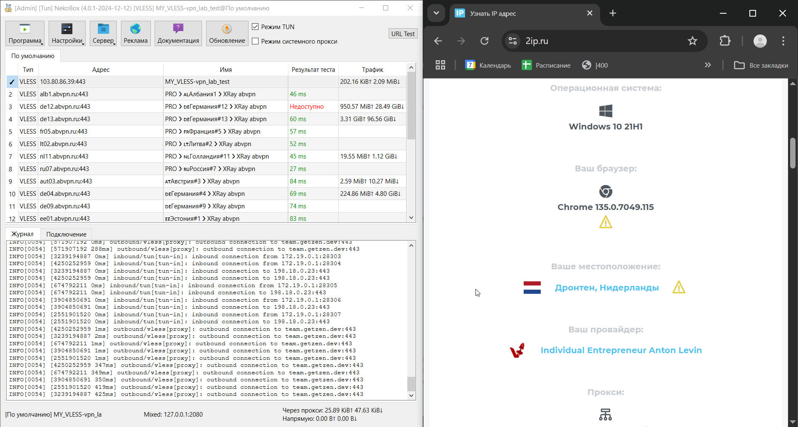

# VPN через VPS сервер

Если хотите результат, смотрите в конец. Тут я больше для себя _(да и вообще ко всем лабам я отношусь)_ расписываю на будущее.

Я арендовал на 1 месяц сервер, находящийся в Нидерландах. 
Для начала проверим провайдера на честность.

Для начала пропингуем:
```
PS C:\Users\AmEl> ping <IP>

Обмен пакетами с <IP> по с 32 байтами данных:
Ответ от <IP>: число байт=32 время=80мс TTL=51
Ответ от <IP>: число байт=32 время=95мс TTL=51
Ответ от <IP>: число байт=32 время=110мс TTL=51
Ответ от <IP>: число байт=32 время=126мс TTL=51

Статистика Ping для <IP>:
    Пакетов: отправлено = 4, получено = 4, потеряно = 0
    (0% потерь)
Приблизительное время приема-передачи в мс:
    Минимальное = 80мсек, Максимальное = 126 мсек, Среднее = 102 мсек
```

Посмотрим на наличие IP-адреса в черных списках РКН (https://2ip.ru/rkn-blacklist/):


Посмотрим на наличие IP-адреса в спам-базах (https://2ip.ru/spam/):


Посмотрим на локацию сервера по IP-адресу (https://www.ip2location.com/demo/<IP>):


Ок, недо-sanity check прошли, все хорошо, 62yun.ru - хороший сервис.

Почитал я статью приложенную, уж слишком там меня попугали всякими взломническими схемами, лучше сделаю следующее:
* Обновлю пакеты, сменю пароль на root на более надежный
* Добавлю пользователя, через которого впоследствии можно будет подключиться по ssh _(`adduser user_name`)_
* Отключу возможность подключения по ssh через root _(поле `PermitRootLogin` в `nano /etc/ssh/sshd_config`)_
* Поменяю стандартный порт подключения ssh с `22` на какой-нибудь другой от `10001` до `65535` _(поле `Port` в `nano /etc/ssh/sshd_config`)_
_Можно было бы настроить подключение по ключу, но, думаю, это уже борщ для лабы, и целенаправленно брутфорсить пароль с 25 символами, надеюсь, не будут (точнее, 2 пароля, т.к. на руте еще один стоит)..._

По итогу я теперь смогу подключаться по ssh следующим образом:
```
ssh coolUser@123.123.123.123 -p 12345
```
Ок, от простейших атак защищены.

Для следующего шага нам потребуется установить docker-engine. Последующие шаги я проделываю для Ubuntu 22.04 LTS _(информация взята с оф. документации Docker)_:
* Зайдем в рут-пользователя: `su -`
* Добавим официальный GPG ключ Docker'а:
    ```
    sudo apt-get update
    sudo apt-get install ca-certificates curl
    sudo install -m 0755 -d /etc/apt/keyrings
    sudo curl -fsSL https://download.docker.com/linux/ubuntu/gpg -o /etc/apt/keyrings/docker.asc
    sudo chmod a+r /etc/apt/keyrings/docker.asc
    ```
* Добавим репозиторий в apt:
    ```
    echo "deb [arch=$(dpkg --print-architecture) signed-by=/etc/apt/keyrings/docker.asc] https://download.docker.com/linux/ubuntu $(. /etc/os-release && echo "${UBUNTU_CODENAME:-$VERSION_CODENAME}") stable" | sudo tee /etc/apt/sources.list.d/docker.list > /dev/null sudo apt-get update
    ```
* Устанавливаем Docker packages через apt:
    ```
    sudo apt-get install docker-ce docker-ce-cli containerd.io docker-buildx-plugin docker-compose-plugin
    ```

Sanity check: `sudo docker run hello-world`

Отлично, откликается:
```
...
Status: Downloaded newer image for hello-world:latest

Hello from Docker!
...
```

Установим Docker Compose plugin: 
```
sudo apt-get update
sudo apt-get install docker-compose-plugin
```

Установим панель 3-XU на сервер.
* Зайдем в рут-пользователя: `su -`
* Склонируем соответствующий репозиторий: `git clone https://github.com/MHSanaei/3x-ui.git`
* Зайдем в создавшуюся директорию и поднимем докер: `cd 3x-ui && docker compose up -d`
Наша панель будет запущена на порту `2053` нашего сервера. Имя пользователя и пароль по умолчанию одинаковые - `admin`.

Позакрываем пару явных дыр _(кроме одной - connection по http)_:
* По умолчанию, к панели можно подключиться напрямую по ip-адресу вашего сервера, указав соответствующую ссылку в браузере. Перейдем в "Настройки панели" и запретим доступ к ней из вне, указав в полях "IP-адрес панели" и "Домен прослушивания панели" значение "127.0.0.1". Таким образом, к панели можно будет получить доступ только после того, как мы подключились к серверу по SSH.
* Поменяем "Порт панели" с порта по умолчанию на какой-нибудь свой `<PANEL_PORT>` от `10001` до `65535` 
* Поменяем "Корневой путь URL адреса панели" c "/" по умолчанию на какой-нибудь свой _(ex. `/mysecretpanel/`)_
* Поменяем логин и пароль, естественно
* Сохраняем изменения и перезапускаем панель. После этого доступ к панели должен закрыться. Теперь надо подключаться по ssh с пробросом портов: `ssh -L <LOCAL PORT>:127.0.0.1:<PANEL_PORT> coolUser@123.123.123.123 -p 12345`. И теперь мы можем получить доступ к панели по адресу: `http://127.0.0.1:<LOCAL PORT>/mysecretpanel/`

Настроим маршрутизацию трафика:
* В "Настройки XRay > Блокировка конфигураций" заблокируем возможность скачивать торренты через наш сервер _(чтобы нам не прилетали жалобы от провайдера, если кто-то попытается качать торренты через наш VPS)_
* Запретим доступ через VPS к Российским сайтам:
  * Заходим во вкладку "Маршрутизация" и нажимаем "Добавить правило"
  * Вписываем в поле `Domain` следующую строку: `geosite:category-ru,regexp:.*\.ru$,regexp:.*\.su$`
  * Выбираем тип выходного подключения _(Outbound Tag)_ как `blocked`
  * Создаем правило
  
Завершительным этапом настройки сервера будет являться создание подключения по протоколу VLESS XTLS-Reality и добавление настроек клиента.
Здесь расписывать этапы бесполезно, ничего особенного не скажу. Лучше опять же смотреть на приложенный в лабе гайд.
* Настроим подключение `MY_VLESS`
* Добавим по инструкции из лабы клиента с email `vpn_lab_test`


Ок, теперь приступим к настройке клиентского приложения. NekoBox'ом я с осени пользуюсь, удобная штука. Ну, кися в коробке работает исправно:
