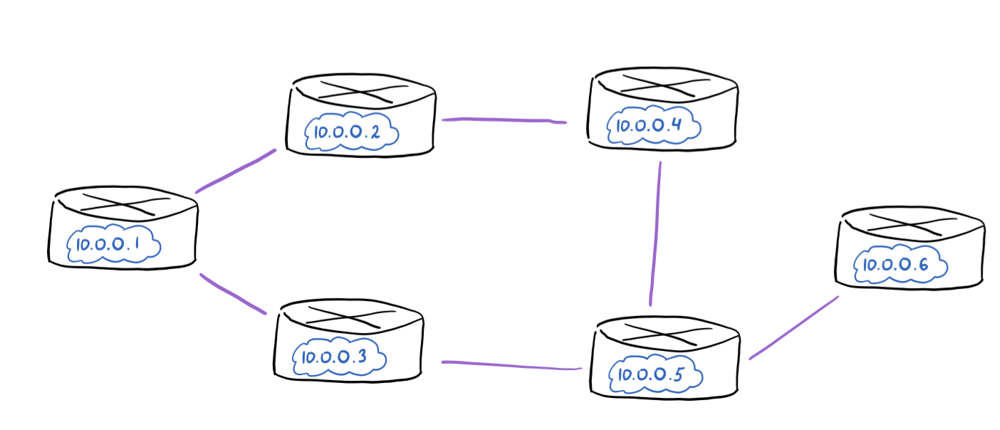
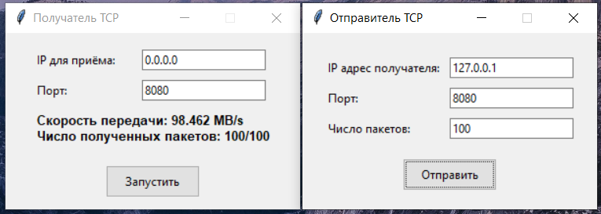
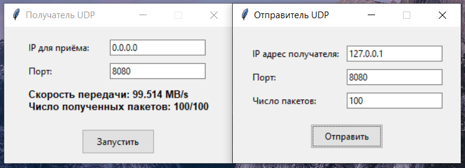

# Практика 12. Сетевой уровень

## 1. RIP (9 баллов)

### Задание А (6 баллов)
Реализуйте эмулятор работы протокола RIP в виде консольного приложения.
Ваша автономная сеть (АС) из маршрутизаторов может быть сконфигурирована на основе файла
(например, `.json`) либо генерироваться случайным образом каждый раз при запуске.

Каждый маршрутизатор должен иметь свой уникальный IP адрес. Это приложение не
предполагает передачу данных по сети, поэтому IP адреса, как и связи между маршрутизаторами,
могут быть произвольными.

Программа должна корректно работать с произвольной АС.

В конце работы программы для каждого маршрутизатора должна быть выведена таблица
маршрутизации. Пример таблицы:
```
Final state of router 198.71.243.61 table:
[Source IP]      [Destination IP]    [Next Hop]       [Metric]  
198.71.243.61    122.136.243.149     42.162.54.248           4  
198.71.243.61    157.105.66.180      42.162.54.248           2  
198.71.243.61    229.28.61.15        42.162.54.248           3  
198.71.243.61    42.162.54.248       42.162.54.248           1  
```

Приведите скрин или лог работы программы.

### Задание Б (1 балл)
Выведите на консоль промежуточные этапы работы протокола: по каждому маршрутизатору
должна быть выведена его текущая таблица маршрутизации.

```
Simulation step 3 of router 42.162.54.248
[Source IP]      [Destination IP]    [Next Hop]       [Metric]  
42.162.54.248    122.136.243.149     157.105.66.180          3  
42.162.54.248    157.105.66.180      157.105.66.180          1  
42.162.54.248    229.28.61.15        157.105.66.180          2  
42.162.54.248    198.71.243.61       198.71.243.61           1  
```

### Задание В (2 балла)

Реализуйте имитацию работы маршрутизаторов в виде отдельных потоков на примере
приложения, рассмотренного на занятии.

Бонус: Не используйте общую память, а вместо этого реализуйте общение потоков через 
сокеты **(+3 балла)**.

#### Пролог
Я написал симулятор протокола RIP, который базируется на DV алгоритме. Собственно говоря, основа кода и будет похожа на код из прошлой лабораторной по алгоритму дистанционно-векторной маршрутизации для сети из рисунка _(конечно, учитывая примочки по типу next hop'а и достаточной бесконечности = 16)_, только теперь потоки общаются через UDP сокеты _(ну еще глобальный лок, чтобы принты друг друга не перекрывали)_.

Топология сети ожидается на вход в виде JSON-файла следующего формата:
```json
{"routers": [
    {
        "ip": "<ip_1>",
        "port": <port_1>,
        "neighbours": ["<ip_i>", "<ip_j>", ...]
    },
    ...
]}
```
Где `routers` - список маршрутизаторов следующего формата:
* `ip` - уникальный IP адрес текущего маршрутизатора _(ненастоящий, напоминаю)_
* `port` - порт, на котором он будет просимулирован
* `neighbors` - список, состоящий из IP адресов его соседей

IP, понятное дело, ненастоящие, но вот порты будут использоваться в симуляции, так что с ними осторожнее.
Желательно выбирать из диапазона портов, не занятого чем-нибудь системным.

В приложенном в `assets/topology.json` файле лежит топология следующей сети:



Аргументы:
```
usage: main.py [-h] [-c CONFIG] [-t TIME]

RIP protocol emulator

options:
  -h, --help            show this help message and exit
  -c CONFIG, --config CONFIG
                        Path to JSON config file
  -t TIME, --time TIME  Simulation time in seconds
```

#### Демонстрация работы
Final state'ы таблиц каждого маршрутизатора:

```
Final state of router 10.0.0.1 table:
[Source IP]     [Destination IP]  [Next Hop]      [Metric]
10.0.0.1        10.0.0.2          10.0.0.2        1
10.0.0.1        10.0.0.3          10.0.0.3        1
10.0.0.1        10.0.0.4          10.0.0.2        2
10.0.0.1        10.0.0.5          10.0.0.3        2
10.0.0.1        10.0.0.6          10.0.0.3        3

Final state of router 10.0.0.2 table:
[Source IP]     [Destination IP]  [Next Hop]      [Metric]
10.0.0.2        10.0.0.1          10.0.0.1        1
10.0.0.2        10.0.0.3          10.0.0.1        2
10.0.0.2        10.0.0.4          10.0.0.4        1
10.0.0.2        10.0.0.5          10.0.0.4        2
10.0.0.2        10.0.0.6          10.0.0.4        3

Final state of router 10.0.0.3 table:
[Source IP]     [Destination IP]  [Next Hop]      [Metric]
10.0.0.3        10.0.0.1          10.0.0.1        1
10.0.0.3        10.0.0.2          10.0.0.1        2
10.0.0.3        10.0.0.4          10.0.0.5        2
10.0.0.3        10.0.0.5          10.0.0.5        1
10.0.0.3        10.0.0.6          10.0.0.5        2

Final state of router 10.0.0.4 table:
[Source IP]     [Destination IP]  [Next Hop]      [Metric]
10.0.0.4        10.0.0.1          10.0.0.2        2
10.0.0.4        10.0.0.2          10.0.0.2        1
10.0.0.4        10.0.0.3          10.0.0.5        2
10.0.0.4        10.0.0.5          10.0.0.5        1
10.0.0.4        10.0.0.6          10.0.0.5        2

Final state of router 10.0.0.5 table:
[Source IP]     [Destination IP]  [Next Hop]      [Metric]
10.0.0.5        10.0.0.1          10.0.0.3        2
10.0.0.5        10.0.0.2          10.0.0.4        2
10.0.0.5        10.0.0.3          10.0.0.3        1
10.0.0.5        10.0.0.4          10.0.0.4        1
10.0.0.5        10.0.0.6          10.0.0.6        1

Final state of router 10.0.0.6 table:
[Source IP]     [Destination IP]  [Next Hop]      [Metric]
10.0.0.6        10.0.0.1          10.0.0.5        3
10.0.0.6        10.0.0.2          10.0.0.5        3
10.0.0.6        10.0.0.3          10.0.0.5        2
10.0.0.6        10.0.0.4          10.0.0.5        2
10.0.0.6        10.0.0.5          10.0.0.5        1
```

Промежуточные этапы протокола:

```
Simulation step 1 of router 10.0.0.1
[Source IP]     [Destination IP]  [Next Hop]      [Metric]
10.0.0.1        10.0.0.2          10.0.0.2        1
10.0.0.1        10.0.0.3          10.0.0.3        1
10.0.0.1        10.0.0.4          -               ∞
10.0.0.1        10.0.0.5          -               ∞
10.0.0.1        10.0.0.6          -               ∞

Simulation step 1 of router 10.0.0.2
[Source IP]     [Destination IP]  [Next Hop]      [Metric]
10.0.0.2        10.0.0.1          10.0.0.1        1
10.0.0.2        10.0.0.3          -               ∞
10.0.0.2        10.0.0.4          10.0.0.4        1
10.0.0.2        10.0.0.5          -               ∞
10.0.0.2        10.0.0.6          -               ∞

Simulation step 1 of router 10.0.0.3
[Source IP]     [Destination IP]  [Next Hop]      [Metric]
10.0.0.3        10.0.0.1          10.0.0.1        1
10.0.0.3        10.0.0.2          -               ∞
10.0.0.3        10.0.0.4          -               ∞
10.0.0.3        10.0.0.5          10.0.0.5        1
10.0.0.3        10.0.0.6          -               ∞

Simulation step 1 of router 10.0.0.4
[Source IP]     [Destination IP]  [Next Hop]      [Metric]
10.0.0.4        10.0.0.1          -               ∞
10.0.0.4        10.0.0.2          10.0.0.2        1
10.0.0.4        10.0.0.3          -               ∞
10.0.0.4        10.0.0.5          10.0.0.5        1
10.0.0.4        10.0.0.6          -               ∞

Simulation step 1 of router 10.0.0.5
[Source IP]     [Destination IP]  [Next Hop]      [Metric]
10.0.0.5        10.0.0.1          -               ∞
10.0.0.5        10.0.0.2          -               ∞
10.0.0.5        10.0.0.3          10.0.0.3        1
10.0.0.5        10.0.0.4          10.0.0.4        1
10.0.0.5        10.0.0.6          10.0.0.6        1

Simulation step 1 of router 10.0.0.6
[Source IP]     [Destination IP]  [Next Hop]      [Metric]
10.0.0.6        10.0.0.1          -               ∞
10.0.0.6        10.0.0.2          -               ∞
10.0.0.6        10.0.0.3          -               ∞
10.0.0.6        10.0.0.4          -               ∞
10.0.0.6        10.0.0.5          10.0.0.5        1

Simulation step 2 of router 10.0.0.1
[Source IP]     [Destination IP]  [Next Hop]      [Metric]
10.0.0.1        10.0.0.2          10.0.0.2        1
10.0.0.1        10.0.0.3          10.0.0.3        1
10.0.0.1        10.0.0.4          10.0.0.2        2
10.0.0.1        10.0.0.5          -               ∞
10.0.0.1        10.0.0.6          -               ∞

Simulation step 2 of router 10.0.0.2
[Source IP]     [Destination IP]  [Next Hop]      [Metric]
10.0.0.2        10.0.0.1          10.0.0.1        1
10.0.0.2        10.0.0.3          10.0.0.1        2
10.0.0.2        10.0.0.4          10.0.0.4        1
10.0.0.2        10.0.0.5          -               ∞
10.0.0.2        10.0.0.6          -               ∞

Simulation step 2 of router 10.0.0.3
[Source IP]     [Destination IP]  [Next Hop]      [Metric]
10.0.0.3        10.0.0.1          10.0.0.1        1
10.0.0.3        10.0.0.2          10.0.0.1        2
10.0.0.3        10.0.0.4          -               ∞
10.0.0.3        10.0.0.5          10.0.0.5        1
10.0.0.3        10.0.0.6          -               ∞

Simulation step 2 of router 10.0.0.4
[Source IP]     [Destination IP]  [Next Hop]      [Metric]
10.0.0.4        10.0.0.1          10.0.0.2        2
10.0.0.4        10.0.0.2          10.0.0.2        1
10.0.0.4        10.0.0.3          -               ∞
10.0.0.4        10.0.0.5          10.0.0.5        1
10.0.0.4        10.0.0.6          -               ∞

Simulation step 2 of router 10.0.0.5
[Source IP]     [Destination IP]  [Next Hop]      [Metric]
10.0.0.5        10.0.0.1          10.0.0.3        2
10.0.0.5        10.0.0.2          -               ∞
10.0.0.5        10.0.0.3          10.0.0.3        1
10.0.0.5        10.0.0.4          10.0.0.4        1
10.0.0.5        10.0.0.6          10.0.0.6        1

Simulation step 2 of router 10.0.0.6
[Source IP]     [Destination IP]  [Next Hop]      [Metric]
10.0.0.6        10.0.0.1          -               ∞
10.0.0.6        10.0.0.2          -               ∞
10.0.0.6        10.0.0.3          10.0.0.5        2
10.0.0.6        10.0.0.4          10.0.0.5        2
10.0.0.6        10.0.0.5          10.0.0.5        1

Simulation step 3 of router 10.0.0.1
[Source IP]     [Destination IP]  [Next Hop]      [Metric]
10.0.0.1        10.0.0.2          10.0.0.2        1
10.0.0.1        10.0.0.3          10.0.0.3        1
10.0.0.1        10.0.0.4          10.0.0.2        2
10.0.0.1        10.0.0.5          10.0.0.3        2
10.0.0.1        10.0.0.6          -               ∞

Simulation step 3 of router 10.0.0.2
[Source IP]     [Destination IP]  [Next Hop]      [Metric]
10.0.0.2        10.0.0.1          10.0.0.1        1
10.0.0.2        10.0.0.3          10.0.0.1        2
10.0.0.2        10.0.0.4          10.0.0.4        1
10.0.0.2        10.0.0.5          10.0.0.4        2
10.0.0.2        10.0.0.6          -               ∞

Simulation step 3 of router 10.0.0.3
[Source IP]     [Destination IP]  [Next Hop]      [Metric]
10.0.0.3        10.0.0.1          10.0.0.1        1
10.0.0.3        10.0.0.2          10.0.0.1        2
10.0.0.3        10.0.0.4          10.0.0.5        2
10.0.0.3        10.0.0.5          10.0.0.5        1
10.0.0.3        10.0.0.6          10.0.0.5        2

Simulation step 3 of router 10.0.0.4
[Source IP]     [Destination IP]  [Next Hop]      [Metric]
10.0.0.4        10.0.0.1          10.0.0.2        2
10.0.0.4        10.0.0.2          10.0.0.2        1
10.0.0.4        10.0.0.3          10.0.0.5        2
10.0.0.4        10.0.0.5          10.0.0.5        1
10.0.0.4        10.0.0.6          10.0.0.5        2

Simulation step 3 of router 10.0.0.5
[Source IP]     [Destination IP]  [Next Hop]      [Metric]
10.0.0.5        10.0.0.1          10.0.0.3        2
10.0.0.5        10.0.0.2          10.0.0.4        2
10.0.0.5        10.0.0.3          10.0.0.3        1
10.0.0.5        10.0.0.4          10.0.0.4        1
10.0.0.5        10.0.0.6          10.0.0.6        1

Simulation step 3 of router 10.0.0.6
[Source IP]     [Destination IP]  [Next Hop]      [Metric]
10.0.0.6        10.0.0.1          10.0.0.5        3
10.0.0.6        10.0.0.2          -               ∞
10.0.0.6        10.0.0.3          10.0.0.5        2
10.0.0.6        10.0.0.4          10.0.0.5        2
10.0.0.6        10.0.0.5          10.0.0.5        1

Simulation step 4 of router 10.0.0.1
[Source IP]     [Destination IP]  [Next Hop]      [Metric]
10.0.0.1        10.0.0.2          10.0.0.2        1
10.0.0.1        10.0.0.3          10.0.0.3        1
10.0.0.1        10.0.0.4          10.0.0.2        2
10.0.0.1        10.0.0.5          10.0.0.3        2
10.0.0.1        10.0.0.6          10.0.0.3        3

Simulation step 4 of router 10.0.0.2
[Source IP]     [Destination IP]  [Next Hop]      [Metric]
10.0.0.2        10.0.0.1          10.0.0.1        1
10.0.0.2        10.0.0.3          10.0.0.1        2
10.0.0.2        10.0.0.4          10.0.0.4        1
10.0.0.2        10.0.0.5          10.0.0.4        2
10.0.0.2        10.0.0.6          10.0.0.4        3

Simulation step 4 of router 10.0.0.6
[Source IP]     [Destination IP]  [Next Hop]      [Metric]
10.0.0.6        10.0.0.1          10.0.0.5        3
10.0.0.6        10.0.0.2          10.0.0.5        3
10.0.0.6        10.0.0.3          10.0.0.5        2
10.0.0.6        10.0.0.4          10.0.0.5        2
10.0.0.6        10.0.0.5          10.0.0.5        1
```

## Скорость передачи (6 баллов)
Реализуйте программу, которая измеряет скорость передачи информации по протоколам TCP и
UDP, а также выводит количество потерянных пакетов.

Программа состоит из двух частей: клиента и сервера. Клиент создает трафик случайным образом
(т.е. генерируется случайная последовательность данных) и отправляет их на сервер. Сервер
подсчитывает количество полученных данных и выводит результат. Время отправки указывается
клиентом вместе с данными.

Ваше приложение должно иметь GUI.

### Пролог
Аргументы:

```
usage: main.py [-h] --mode {client,server} --protocol {Protocol.TCP,Protocol.UDP}

Network: measuring speed and loss over TCP/UDP

options:
  -h, --help            show this help message and exit
  --mode {client,server}
                        mode: client/server
  --protocol {Protocol.TCP,Protocol.UDP}
                        protocol: tcp/udp
```

Возможно, немного запутывает enum в протоколе, поэтому вот пример запуска TCP-клиента:
`python main.py --mode client --protocol tcp`

Я пытался вытащить максимум точности, но, даже прокидывая время в наносекундах, все равно есть случаи (и это происходит при маленьком количестве пакетов), когда start и end time совпадают. Поэтому я решил оставить `time.time()` и прокидывать ошибку с предложением увеличить количество пакетов. Я думаю, так чище и логичнее.

### 1. Измерение по протоколу TCP (3 балла)
Пример интерфейса:


#### Демонстрация работы


### 2. Измерение по протоколу UDP (3 балла)
Пример интерфейса:


#### Демонстрация работы

   

## Транслятор портов (6 баллов)
Разработать приложение – транслятор портов. Трансляция осуществляется в соответствии с
набором правил трансляции, заданных в конфигурационном файле. Каждое правило должно
указывать, с какого порта на какие IP адрес и порт транслировать. При изменении
конфигурационного файла новые правила должны вступать в действие, но установленные
соединения не должны разрываться. В программе должен быть реализован GUI.

Пример GUI:


#### Демонстрация работы
todo
